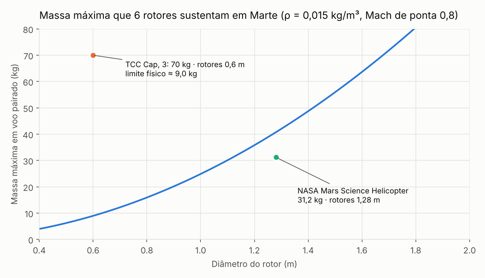
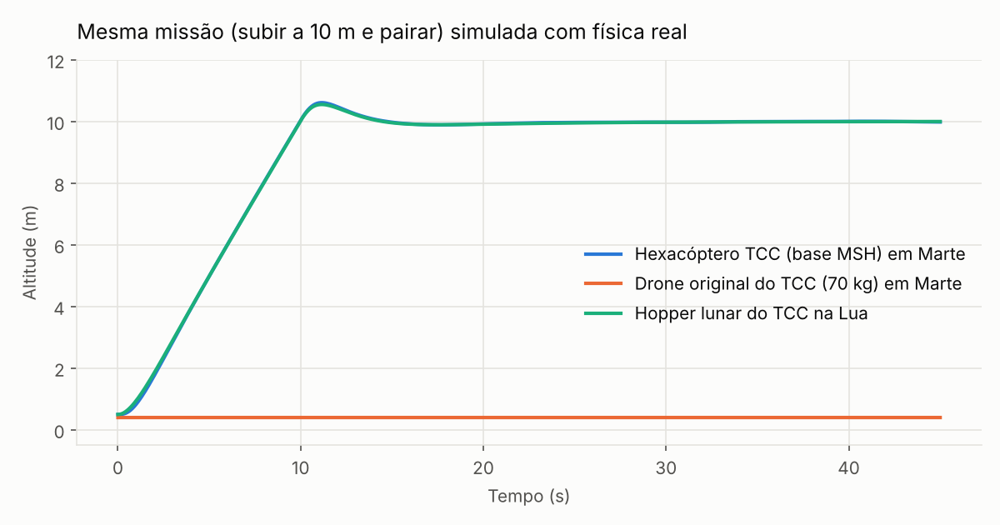
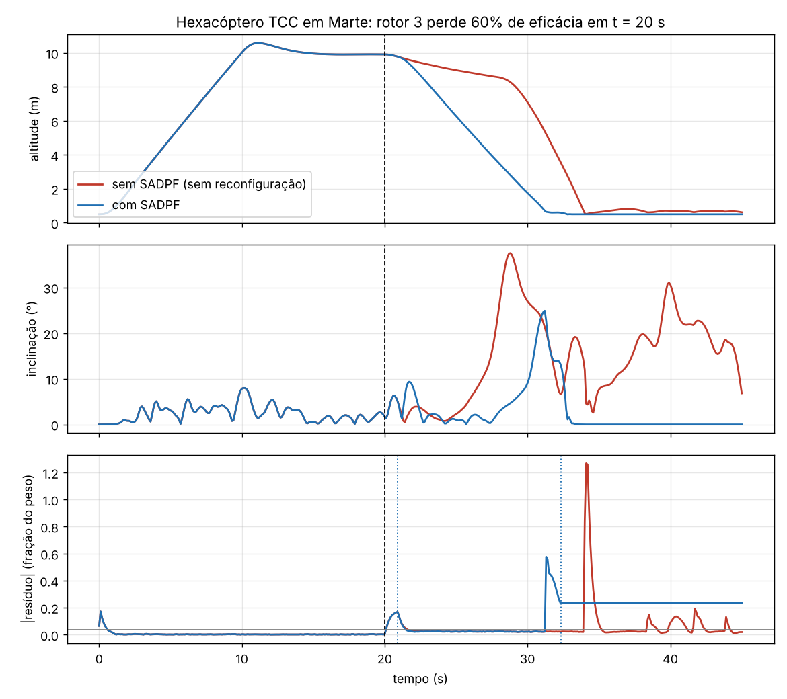
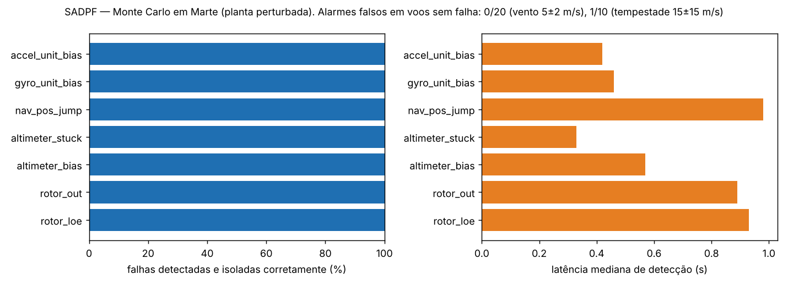

# Twin v2/v3: physics core, navigation and fault diagnosis

> **Templates de veículo.** O Twin agora tem dois templates sobre o mesmo motor de simulação (`src/physics/templates.py`):
> `drone_marte` (hexacóptero classe NASA MSH, inalterado) e `helicoptero_uti` (helicóptero bimotor leve de
> transporte aeromédico, classe H135 — ver [docs/helicoptero-uti.md](docs/helicoptero-uti.md)).
>
> **Simulador conceitual e educacional. Não é um simulador certificado (FSTD) nem substitui dados do fabricante.**

Twin v2 replaces the kinematic motion of the original Twin with a 6-DoF physics model. In that model, gravity, air density and actuator limits decide whether and how the drone flies. The code lives in `src/physics/` and depends only on `numpy` and `scipy`.

Phase 1 delivered the physics core, the thesis vehicles, the verification tests and the validation figures. Phase 2 (below) connects the web interface (`simulation_server.py`) to that core, replacing the old kinematic loop.

## Results (see `docs/twin_v2/`)

| Vehicle | Body | T/W | Hover power | Hover endurance | Status |
| --- | --- | --- | --- | --- | --- |
| `mars_hexacopter_tcc` (MSH class, 31.2 kg, 6 × 1.28 m) | Mars (0.015 kg/m³, −50 °C) | 1.31 | 6.2 kW (NASA: 6.2 kW) | 11.6 min (1200 Wh) | Flies; holds 10 m within ±0.05 m in wind |
| `tcc_mars_70kg_original` (thesis Ch. 3, 70 kg, 6 × 0.6 m) | Mars | 0.13 | — | — | Cannot take off; 6 × 0.6 m rotors lift at most ~9 kg |
| `lunar_hopper_tcc` (80 kg incl. 35 kg propellant) | Moon | 1.85 | — (propellant: 0.056 kg/s) | 13.4 min hover; Δv ≈ 1,300 m/s | Flies; holds 10 m within ±0.05 m |
| any rotorcraft | Moon | 0 | — | — | Rotors produce no thrust in vacuum |




To regenerate: `python tools/twin_validation_report.py`

## Model

| Part | Model |
| --- | --- |
| Atmosphere | Constant lapse rate, hydrostatic with the body's own gravity; ρ = p/(RT); speed of sound a = √(γRT), with γ = 1.29 for CO₂ (Mars) |
| Rotor | Constant tip speed V_t = min(M_tip·a, V_motor), collective thrust control. T_max = (C_T/σ)_max·σ·ρ·A·V_t² |
| Rotor power | Momentum theory: P = T^1.5 / (FM·√(2ρA)) / η_motor; reaction torque Q = P/Ω |
| Thrusters | Throttleable, ṁ = F/(Isp·g₀) |
| Rigid body | Quaternion attitude, Newton–Euler with gyroscopic term, 4th-order Runge–Kutta at 200 Hz |
| Environment | Airframe drag relative to wind; wind = mean + Gauss–Markov gusts; spring–damper landing legs with friction |
| Control (50 Hz) | PID position loop + geometric SO(3) attitude controller (Lee et al., 2010); bounded least-squares control allocation that respects every actuator limit |

## Verification (`tests/test_physics_core.py`, 18 tests; `tests/test_web_session.py` covers Phase 2)

The tests run with `python -m pytest tests/ -v` or `python -m unittest discover -s tests -t . -v`, and in CI through `.github/workflows/twin-tests.yml`. They check:

- Free fall matches g on Earth, Mars and the Moon (to 10⁻⁶ m).
- A torque-free asymmetric tumble conserves energy and angular momentum (relative error < 10⁻⁶), and the quaternion norm stays at 1 (to 10⁻⁹).
- Rotors make zero thrust in vacuum.
- Thrust scales with ρ·V_t², so an Earth drone keeps less than 2% of its thrust on Mars.
- NASA MSH parameters reproduce NASA's 6.2 kW hover power (within 15%) and C_T/σ = 0.115.
- The thesis's original 70 kg Mars drone cannot hover, and in simulation it stays on the ground.
- The validator flags the three legacy "optimized" configurations that cannot lift off even on Earth.
- Closed-loop hover in Mars wind stays within ±0.5 m, and the time-domain power is within 5% of the closed-form estimate.
- Battery energy used equals the integrated power, and lunar propellant used equals ∫F dt/(Isp·g₀).

**Honest scope.** The MSH check confirms that the implementation reproduces NASA's numbers from NASA's own inputs. It is *verification*, not independent experimental *validation*. Values marked as assumptions in `config/drone_models.json` (stall limit C_T/σ = 0.15, battery capacity, inertia, drag area, lunar Isp ≈ 230 s) should be cited as such in the thesis.

## Usage

```python
from src.physics import load_vehicle, load_body, TwinSimulator, hover_at, hover_report

mars = load_body("mars")
hexa = load_vehicle("mars_hexacopter_tcc", payload=2.0)
print(hover_report(hexa, mars))           # closed-form T/W, power, endurance
print(hexa.validate(mars))                # physical sanity warnings

sim = TwinSimulator(hexa, mars, seed=1)
tel = sim.run(60.0, hover_at([0, 0, 10]))
print(tel.column("power_w").mean(), tel.column("battery_wh")[-1])
```

## Phase 2: the web app flies the physics core

**What changed**

- `src/physics/web_session.py` (`WebSession`) owns a `TwinSimulator`, the mission state and the telemetry dict. It has no Flask dependency and is tested in `tests/test_web_session.py`.
- `simulation_server.py` no longer moves the drone kinematically (fixed 5 m/s, fake sinusoidal attitude). At start it builds a `WebSession` from the selected vehicle, environment (or the custom environment, whose typed air density is honoured) and mission. Each 0.1 s tick then integrates 0.1 s of physics (20 RK4 steps at dt = 5 ms, control at 50 Hz) and sleeps for the rest of the tick. Pause and stop work as before.
- Missions use `waypoint_route` with each waypoint's `tolerance` as acceptance radius and `duration` as hold time. Cruise speed is the minimum of the mission's `cruise_speed` (or `constraints.max_speed`), the vehicle's `flight_envelope.max_speed` and 5 m/s. The reference now follows a trapezoidal speed profile (`max_accel` = half the tilt-limited acceleration, at most 1 m/s²). Without it, the lunar hopper (0.38 m/s² of usable horizontal acceleration) overshot waypoints by about 30 m and tipped over on landing.
- Feasibility check before flight: `vehicle.validate(body)` and `hover_report`. If T/W < 1 the vehicle is still simulated (it stays on the ground) and the server emits `twin_warning`, e.g. *"Este veículo não consegue decolar em Marte (T/W = 0,12)"*. The warning is also returned by `/api/simulation/start` and `/api/simulation/status` (`twin`, `warning`). If the vehicle has not lifted off after 20 s of simulated time, the mission ends as `failed`.
- End states: `completed` (all waypoints, `mission_complete` event), `failed` (no lift-off, tip-over > 60°, battery or propellant exhausted; `mission_failed` event), `timeout` (`success_criteria.flight_time_max`; stored as `completed_timeout` as before).
- New mission `reconhecimento_marte_tcc` ("Reconhecimento Marte - TCC"): climb to 15 m, 3 observation points within 50 m, land at the start point (about 85 s on Mars, about 105 s on the Moon). All vehicles in `config/drone_models.json`, including the three TCC vehicles, appear in the UI's vehicle list.
- UI: a compact **Física do Twin** panel (power, battery, propellant, air density, rotor tip Mach, T/W) and a warning banner. The vertical/3D speed and the Power & Energy chart now use the physics values. Older sessions without them fall back to the previous estimates.
- Performance: `np.cross` was about 70% of the step time. It is replaced by a plain 3-vector `cross3` (same arithmetic), which makes the core 2.4–3× faster. Physics uses 12–24% of each 0.1 s tick, so the web loop runs in real time at dt = 5 ms. If a slow host cannot keep up, the simulation runs slower than real time without dropping physics steps (`realtime_factor` in the status).

**Run:** `python run.py` (needs `flask`, `flask-socketio` and the database packages from `pyproject.toml`), then choose e.g. `mars_hexacopter_tcc` + `mars` + `reconhecimento_marte_tcc`.

**Telemetry** (`telemetry_update` payload): the legacy fields are unchanged (`position`, `velocity`, `attitude` roll/pitch/yaw in rad, now from the quaternion; `altitude` = height of the centre of mass, about 0.5 m when resting on the legs; `ground_speed`, `vertical_speed`, `vector_speed`, `mission_progress` in %, `current_waypoint`, `mission_status`, `total_distance`, `timestamp`). New fields:

| Field | Unit | Meaning |
| --- | --- | --- |
| `power_w` | W | Electrical power: rotors + avionics + heaters |
| `battery_wh`, `battery_pct`, `energy_consumed` | Wh, %, Wh | Battery state and energy used |
| `propellant_kg` | kg | Propellant remaining (hoppers) |
| `air_density` | kg/m³ | At the current altitude (0 in vacuum) |
| `tip_mach` | – | Rotor tip Mach number |
| `thrust_to_weight` | – | Available vertical force / current weight |
| `on_ground` | bool | A landing leg touches the ground |
| `wind_speed` | m/s | Current wind (mean + gust) |
| `angular_velocity` | rad/s | Body rates |

Note: the web app uses `config/environments.json` Mars (610 Pa, 210 K → ρ = 0.0154 kg/m³, a = 226 m/s). Under these conditions `mars_hexacopter_tcc` has T/W = 1.26 and shows a "low control margin" warning. The table above uses NASA's design point (0.015 kg/m³ at −50 °C), which gives T/W = 1.31.

## Phase 3: sensors, EKF and the SADPF (thesis Ch. 5.4)

**What it adds** (all optional; without these options, phases 1 and 2 behave exactly as before):

| Part | Model |
| --- | --- |
| Sensors (`sensors.py`) | **3 IMUs** (accel + gyro, white noise, turn-on bias, bias random walk) fused by median vote. Downward **laser altimeter** (slant range, 0.3–50 m). **Visual navigation** (position and heading, 5 Hz). **Barometer**, with noise set in pascals, so altitude noise follows σ_p/(ρg): about 3.5 m on Mars and 0.02 m on Earth. No magnetometer, because Mars has no global magnetic field. |
| Navigation (`ekf.py`) | 15-state error-state EKF (Solà 2017): position, velocity, attitude, accelerometer bias, gyro bias. Every update computes its NIS, and a 99.9 % χ² gate rejects outliers. Divergence recovery reopens the covariance when two independent sensors are rejected at the same time. |
| Faults | `RotorFault(index, effectiveness, t)`: loss of effectiveness, meaning the rotor spends the commanded power but delivers only part of the thrust. `SensorFault(sensor, kind, t, value, unit)` with kind = bias, stuck, dropout or noise. |
| SADPF (`sadpf.py`) | **Model-based diagnosis**: force residual r_F = m·a_z − Σ e_i f_i and roll/pitch residual r_M = Iω̇ + ω×Iω − M(f). A first-order actuator model driven by the commands predicts f, and the same low-pass filter is applied to both sides of each residual. The rotor is isolated by the column that best fits the residual, and the fit also gives its effectiveness. **Sensors**: repeated χ² rejections isolate a sensor, a reading that stops changing is flagged as stuck, and a single IMU unit is isolated when it leaves the 3-unit vote. **Levels** follow 5.4.2: Nível 1 aviso, Nível 2 alerta (reconfigure the control allocation, isolate the sensor), Nível 3 crítico (land). **Prognosis**: after a rotor fault, a linear program computes the thrust-to-weight still available with roll and pitch balanced. If it is below 1.1, the vehicle could hover but not manoeuvre, so the SADPF lands it. A land detector cuts the motors only once the vehicle is on its legs and still. |
| Web | `WebSession(..., sadpf=True)` (on by default in `simulation_server.py`). `POST /api/simulation/fault` injects faults. Telemetry carries `sadpf` (level, residual, EKF error, rotor effectiveness, isolated sensors, events), and the server emits `sadpf_event`. The UI has a SADPF panel with fault injection. |

**Monte Carlo campaign** (`python tools/twin_fault_campaign.py`, results in `docs/twin_v3/`)

- Setup: 130 flights of `mars_hexacopter_tcc` on Mars, each with one fault injected at a random time.
- Model mismatch: every flight uses a **perturbed plant**, while the controller and SADPF keep the nominal model:
  - mass N(1, 1 %)
  - inertia U(0.9, 1.1)
  - per-rotor thrust scale N(1, 2 %)
  - actuator time constant U(0.8, 1.2)
- Wind: 5 ± 2 m/s, the operating envelope of a Mars rotorcraft (Ingenuity was cleared for about 10 m/s).

| Scenario | Detected and isolated | Median / max latency | Notes |
| --- | --- | --- | --- |
| No fault, 20 flights | — | — | **0 false alarms** |
| No fault, dust-storm wind 15 ± 15 m/s, 10 flights | — | — | 1 false alarm (Nível 1); the drag the diagnosis does not model shows in the residual |
| Rotor loss of effectiveness 25–70 %, 20 flights | **20/20**, correct rotor | 0.93 / 1.08 s | LOE estimate error 4.7 % (median). 16 flights landed because the margin left was < 1.1. Without SADPF: 3/20 tipped over and the median altitude loss was 6.4 m. With SADPF: 0 tipped over and the median altitude loss was 0.23 m. |
| Rotor stopped, 10 flights | **10/10** | 0.89 / 0.91 s | **With SADPF 10/10 landed upright** (touchdown ≤ 3.6 m/s). **Without SADPF 10/10 tipped over.** |
| Laser altimeter bias / stuck | 10/10 and 10/10 | 0.57 s / 0.33 s | flight continues on the other sensors |
| Visual-nav position jump 2–6 m | 10/10 | 0.98 / 1.09 s | Nível 3: no position reference, so it lands in place (median navigation error during landing 4.8 m) |
| Gyro or accelerometer fault in one IMU | 10/10 and 10/10 | 0.46 s / 0.42 s | Outvoted by the other two IMUs. The flight continues. |




**Honest scope**
- The plant is perturbed, but the diagnosis still uses the same physics family as the simulator. These results are *verification* of the method, not hardware validation.
- Detectability limit: a loss below about 20 % on one rotor stays inside the residual threshold (3.5 % of weight).
- On the TCC baseline (T/W 1.26 in the app's Mars), a loss of more than about 40 % on one rotor leaves too little margin. The vehicle must land. This is a design finding: fault tolerance needs a larger T/W margin, or a rotor layout (e.g. coaxial or PPNNPN) that keeps yaw authority.
- The app's default Mars wind (15 m/s mean, 15 m/s gust σ) is dust-storm level, beyond what a Mars rotorcraft would fly in.

## Next phases

4. Rewrite the thesis Ch. 3, 5.4, 6 and 7 with these results, and clean up the repository (move videos and audio to Git LFS or Releases).
