# Template "Helicóptero UTI": helicóptero bimotor leve de transporte aeromédico (classe H135)

> **Simulador conceitual e educacional. Não é um simulador certificado (FSTD) nem substitui dados do fabricante.**
>
> O modelo é genérico, sem marca, logotipo ou pintura de fabricante. "Classe H135" indica apenas a ordem de grandeza da aeronave de referência, cujos dados públicos foram usados.

Estado atual: **Passos 0 a 3 aprovados. O Passo 4 (HUD e cenas do Template A) está concluído e aguarda aval.** Depois dele vem o Template B (classe UH-60), conforme o roteiro.

> **CI.** A suíte completa e o teste de fumaça do HUD rodam no GitHub Actions a cada PR (ver o README_TWIN.md). [#20 (PR #6)](https://github.com/fasn98/DroneSimulator/actions/runs/37259802968) e [#21 (PR #7)](https://github.com/fasn98/DroneSimulator/actions/runs/37307459563) passaram depois que o repositório ficou público.

## Como rodar

```bash
python -m unittest tests.test_helicopter_physics -v   # validação do Passo 1 (14 testes)
python -m unittest tests.test_helicopter_scenarios -v # validação do Passo 2 (15 testes, ~5 min)
python -m unittest tests.test_template_regression      # drone de Marte idêntico ao de antes
python tools/heli_step1_report.py                      # números-chave e figuras das curvas de potência
python -m tools.heli_hv_refine                         # pior margem do H-V e grade refinada (~35 min)
python -m tools.heli_antitorque_sensitivity A          # sensibilidade da deriva (~1 min)
python -m tools.heli_antitorque_sensitivity B          # sensibilidade do duto, com massas Cat A (~40 min, retomável)
python -m unittest tests.test_helicopter_mission -v   # validação do Passo 3
python -m tools.heli_step3_report                      # massa, CG, combustível e raio de ação (~2 min)
python -m tools.heli_rescue_site_report                # decolagem do local de resgate (~20 min)
python -m tools.heli_step2b_report                     # massas Cat A (2 critérios), falha × TDP, H-V (~70 min)
python -m tools.heli_step2_report                      # demais cenários do Passo 2 (~5 min; usa o JSON acima)
python -m tools.heli_flare_sweep 110 2                 # varredura do flare (~15 min por rodada)
python tools/heli_docs.py                              # regenera a tabela de parâmetros deste documento
```

```python
from src.physics.templates import get_template
heli = get_template("helicoptero_uti")
sim = heli.build(seed=1)                       # ISA, nível do mar, MTOW
tel = sim.run(30.0, heli.default_guidance())   # decola e paira a 15 m
```

## Arquitetura

- O helicóptero usa o mesmo motor de simulação do drone: `SimulationLoop`, com física a 200 Hz e controle a 50 Hz, o mesmo vento com *seed* e o mesmo contêiner de telemetria. Ele usa também as mesmas funções de guiagem (`hover_at`, `waypoint_route`).
- O código específico fica em `src/physics/helicopter/`:

| Arquivo | Conteúdo |
|---|---|
| `params.py` | Tabela de parâmetros com valor, unidade, status e fonte (a mesma tabela que aparece abaixo) |
| `isa.py` | Atmosfera ISA com ΔT e elevação do heliponto; altitude-densidade |
| `rotor.py` | Rotor principal, efeito solo, anel de vórtice, rotor de cauda carenado, *trim* e curva de potência |
| `model.py` | Corpo rígido 6-DoF, NR, *flapping*, dois turboeixos, esquis, limites de potência por regime |
| `simulator.py` | `HelicopterSimulator`: SAS/piloto automático, governador de NR, falhas de motor, modo autorrotação |
| `sadpf.py` | SADPF do helicóptero: detecção e isolamento de falha de motor e ação recomendada (Passo 2) |
| `procedures.py` | "Piloto" dos cenários: Categoria A, autorrotação com flare, rota ponto a ponto, critérios (Passo 2) |
| `scenarios.py` | Cenários prontos e cálculo da massa máxima Categoria A (Passo 2) |

## Modelos e equações

### 1. Atmosfera
- ISA conforme ICAO Doc 7488 / ISO 2533.
- Na altitude h: pressão p_ISA(h) e temperatura T_ISA(h) + ΔT, com ρ = p/(R·T).
- A altitude-densidade é a altura ISA que tem a mesma ρ.
- A elevação do heliponto e o ΔT são configuráveis em `HeliAtmosphere`.

### 2. Rotor principal: elemento de pá + momento, inflow uniforme, quase-estático
- **Empuxo**, com torção linear e coletivo θ₇₅:
  C_T = (σa/2)·[θ₇₅/3·(1 + 1,5μ²) − λ/2], com λ = λ_c + λ_i.
- **Velocidade induzida**: v_i = k_GE · v_h(T) · v̂(V_c/v_h, V_x/v_h), onde v_h = √(T/2ρA).
- **Curva universal v̂**:
  - momento de Glauert, v̂·√(y² + (x+v̂)²) = 1, tomando a menor raiz positiva (ramos de funcionamento normal e de moinho);
  - na região de anel de vórtice (−2 ≤ x ≤ 0 e y < 1), mistura com peso (1 − y) da curva empírica v̂ = 1 + k₁x + k₂x² + k₃x³ + k₄x⁴ (Johnson 1980, reproduzida em Leishman 2006; coeficientes a conferir na fonte primária);
  - empuxo negativo usa a curva espelhada.
- **Solução**: por busca de raiz com intervalo (Brent). Há uma solução única e contínua em todo estado, inclusive perto de empuxo zero.
- **Potência**: P = T·(V_c + κ·v_i) + P₀·(1 + 4,65μ²), com P₀ = σ·C_d0/8·ρ·A·V_t³.
  - Na simulação 6-DoF, V_c é o escoamento através do plano das pontas. Em voo à frente, o disco inclinado contra o arrasto da fuselagem gera sozinho a parcela parasita T·V·sen α = D·V.
- **Figura de mérito resultante** (pairado, MTOW, ISA nível do mar): **0,73**.

### 3. Efeito solo (Cheeseman & Bennett, 1955)
- Com empuxo constante, a velocidade induzida é multiplicada por k_GE = 1 − (R/4z)²/(1 + (V/v_i)²).
- No pairado, isso equivale a T_IGE/T_OGE = 1/(1 − (R/4z)²) com a mesma potência; a fórmula do pairado foi conferida no PDF original.
- **Limite (aprovado)**: a fórmula é usada para z/R ≥ **0,5**. Abaixo disso o fator fica **constante no valor de z/R = 0,5** (não é zerado nem extrapolado). Motivo: em z/R = 0,25 a fórmula é singular (razão de empuxo infinita), e os autores só relatam concordância com voo para z/R > 0,6.
- No esqui (cubo a 3,0 m, z/R = 0,59), a potência de pairado cai **15 %**.

### 4. Voo à frente e curva de potência
- *Trim* em voo nivelado: T = √(W'² + D²) e inclinação do disco α = atan(D/W').
  - W' inclui o *download* da fuselagem, que some com a velocidade.
  - D = ½ρV²f.
- Potência total = induzida + perfil·(1 + 4,65μ²) + parasita ½ρV³f + rotor de cauda + acessórios, dividida pelo rendimento da transmissão.
- **Área de arrasto f: CALIBRADA**, não estimada. Escolhida de modo que o cruzeiro rápido publicado (136 kt, folheto Airbus de 2022, sem condições declaradas) exija a potência máxima contínua AEO (2 × 69 % de torque = 567 kW) ao nível do mar, ISA, no MTOW. Resultado: f = **1,50 m²** (era 1,37 m² antes do modelo da deriva, que reduziu a potência de cauda no cruzeiro).
- **2ª validação (velocidade máxima)**: a página técnica da Airbus informa "Max speed: 140 kts" no MTOW. A curva cruza a potência AEO de decolagem (616 kW) em **142,0 kt**, um erro de **+1,5 %**.
  - Essa comparação é só parcialmente independente: a mesma área f calibrada vale para as duas velocidades.
  - A comparação com 136 kt na potência máxima contínua dá 0 % por construção, porque é o ponto de calibração. Não serve como validação.
  - A mesma página rotula 136 kt como "Maximum speed (VNE)", o que conflita com o VNE de 155 KIAS do TCDS. Por isso o valor de 136 kt foi tomado do folheto, onde aparece como cruzeiro rápido.
  - Kampa et al. (1997) dão "Vcruise 141 kts" para o EC135 da época, sem informar a massa.
- **Soma dos componentes × total**: no pairado, a potência total requerida dos motores (594 kW) fica ~28 kW (4,7 %) acima da soma rotor + cauda (566 kW). A diferença é a perda de transmissão (η = 0,97, ~18 kW) mais os acessórios (10 kW), que não aparecem como curvas separadas no gráfico.
- A velocidade de máxima autonomia é o mínimo de P. A de máximo alcance é o mínimo de P/V, sem vento.

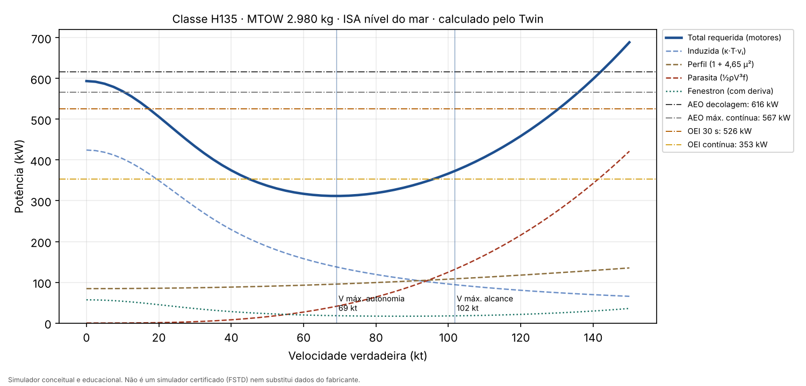

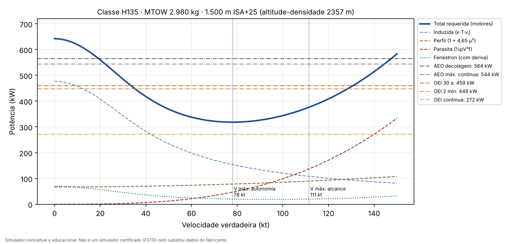

- A 1.500 m ISA+25 (altitude-densidade de ~2.360 m), o pairado fora do efeito solo no MTOW exige ~642 kW, acima dos 564 kW AEO disponíveis. A potência OEI 30 s (459 kW) só sustenta voo nivelado entre ~35 e ~127 kt. Isso explica as massas Categoria A em altitude.

### 5. Antitorque: rotor de cauda carenado (tipo Fenestron) e deriva vertical
- O modelo **já tratava** o rotor de cauda como carenado: a potência induzida de ventilador carenado ideal com razão de expansão σd = 1 é 1/√2 da de um rotor aberto. Agora a razão de expansão é um parâmetro explícito (σd, ESTIMADO = 1,0, sem dado público do difusor do Fenestron).
  - P_ind = κ·T^1,5/√(4·σd·ρ·A).
  - Com σd = 1, o duto carrega metade do empuxo. Para o mesmo empuxo, a potência induzida é 1/√2 ≈ 0,71 da de um rotor aberto. Para a mesma potência, o empuxo é 2^(1/3) ≈ 1,26 vez maior: esse é o fator de aumento de empuxo (teoria ideal, Leishman).
  - No pairado no MTOW, o Fenestron pede **57 kW** contra **80 kW** de um rotor aberto de mesmo diâmetro.
- **Deriva vertical (novo)**: força lateral em voo à frente, F = q·S·a·(α₀ − β), limitada a |C_L| ≤ 1,0.
  - S = 0,9 m² (FONTE: "small fin" do EC135 em Kampa et al. 1997; a deriva do H135 atual pode diferir).
  - Inclinação a = 3,0/rad (ESTIMADO); incidência/arqueamento efetivo α₀ = 6° (ESTIMADO).
  - A deriva atua no mesmo braço do Fenestron e alivia o empuxo exigido dele: T_tr = Q/l_tr − F_deriva.
  - No cruzeiro de 136 kt, a deriva assume **41 %** do antitorque, e a potência do Fenestron cai de ~67 para **27 kW**.
  - No 6-DoF a deriva entra nas forças, no momento de guinada (com estabilidade direcional pelo termo de derrapagem) e na alimentação do pedal do SAS. O amortecimento de guinada da deriva continua no parâmetro agrupado de amortecimento de guinada, para não ser contado duas vezes.
- Resultado no pairado: **11 %** da potência do rotor principal (inalterado, a deriva não atua no pairado).

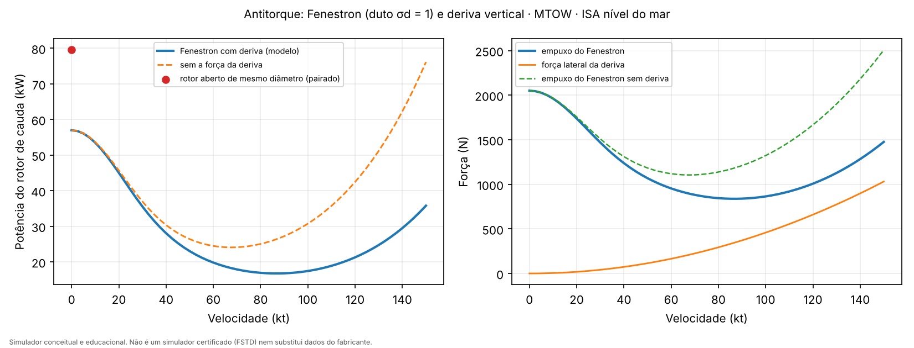

### 6. Rotação do rotor (NR), base da autorrotação
- I·Ω·dΩ/dt = η·(P₁ + P₂) − P_rotor − P_cauda − P_acessórios.
- A inércia I é **ESTIMADA** (1.000 kg·m², ordem de grandeza do Bo105; não há dado público do H135).
- **Governador**: a demanda de potência é a potência requerida mais um termo de erro de NR, dividida entre os motores em funcionamento e limitada por regime.
- **Proteção contra queda de NR**: o SAS devolve coletivo se o NR cair abaixo de 98,5 %.

### 7. Plano das pontas (*flapping*)
- Modelo quase estático com lag de 1ª ordem: dβ/dt = (β_cmd − β)/τ_f − q, com τ_f = 16/(γΩ) (Padfield) = **0,076 s**.
- O termo −q faz o disco "ficar no espaço" quando a fuselagem gira. Isso produz o amortecimento natural do rotor.
- Momento no cubo: braço do cubo × empuxo, mais a rigidez do rotor sem articulação (ESTIMADA).
- Não há modelo de pá elástica nem de *blowback* (ver Limitações).

### 8. Anel de vórtice (VRS)
- **Alerta** quando −1,5 ≤ V_c/v_h ≤ −0,5 e V_x/v_h < 1.
- **Fonte**: W. Johnson, NASA/TP-2005-213477, que relata movimento vertical instável entre −0,5 e −1,5·v_h (Drees 1949: −0,62 a −1,53) e efeitos de VRS que desaparecem acima de V_x ≈ v_h (ensaios de Taghizad).
- O alerta é um critério de exibição. O que acontece na física (descida acelerada) vem da curva de inflow do item 2.

### 9. Motores e transmissão
- Dois turboeixos classe PW206B3.
- **Potência térmica**: valores do TCDS IM.E.017 ao nível do mar, com lapso σ^0,75 (**ESTIMADO**).
- **Limites da transmissão**: os torques do TCDS EASA R.009 (2 × 75 % AEO TO, 2 × 69 % MCP, 128 % OEI 30 s, 125 % OEI 2 min, 86 % OEI contínuo) × potência a 100 % de torque (665 N·m a 5.898 rpm = 410,7 kW).
- O limite efetivo é o **menor** dos dois. Ao nível do mar, a transmissão limita: 616 kW AEO; 526, 513 e 353 kW OEI.
- **Regimes OEI automáticos** após a falha: 30 s → 2 min → contínuo. Esse cronômetro alimenta o HUD no Passo 4.

### 10. Comandos e SAS
- Comandos: coletivo (θ₇₅), cíclico longitudinal e lateral (inclinação comandada do disco) e pedais (empuxo do rotor de cauda).
- **SAS/piloto automático** para cenários roteirizados:
  - **horizontal**: posição → velocidade → vetor de empuxo desejado → atitude (erro em SO(3), como no drone) → momento → cíclico;
  - **vertical**: velocidade vertical → empuxo → coletivo pela relação de elemento de pá no inflow atual;
  - **guinada**: torque de acionamento + correção de proa → pedal;
  - **autorrotação**: o coletivo passa a controlar o NR, e a altura fica livre.
- O empuxo lateral do rotor de cauda é compensado por inclinação lateral: há ~4° de rolagem de equilíbrio no pairado.

## Validação (Passo 1): `tests/test_helicopter_physics.py`, 14 testes passando

| Verificação | Resultado | Critério |
|---|---|---|
| Pairado OGE, MTOW, ISA nível do mar | **594 kW** requeridos (rotor 509 + cauda 57 + acessórios, ÷ η) contra 616 kW AEO disponíveis | sem valor público direto; ver a linha seguinte |
| Teto de pairado OGE publicado: 7.200 ft ISA (dado Airbus do H135; a massa não é informada) | modelo: 639 kW requeridos contra 571 kW disponíveis a 7.200 ft, divergência de **+11,7 %** | ±15 %: **passa** (o modelo fica conservador; ver Divergências) |
| Figura de mérito no pairado | 0,73 | 0,65–0,80 |
| Efeito solo no esqui | −15 % de potência | reduz |
| Curva de potência | V máx. autonomia **69 kt** (314 kW); V máx. alcance **102 kt** (376 kW) | V_be < V_br, com balde |
| Rotor de cauda | 11 % da potência do rotor principal (calculado) | 5–20 % |
| NR sem potência e coletivo parado | cai de 100 % para 85 % em **1,5 s**; decaimento monotônico | abaixo de 85 % (mínimo sem motor do TCDS) |
| Autorrotação com coletivo baixado (modo NR) | NR entre 99,9 % e 100,0 %; descida vertical de **22,9 m/s** (≈ 1,8·v_h, como prevê a teoria) | 85–106 % (TCDS) |
| Falha de um motor | regimes OEI 30 s → 2 min seguem o cronômetro; potência disponível 526 kW | conforme TCDS |
| VRS | alerta em descida vertical a 1·v_h; sem alerta a 0,2·v_h ou com V_x = 2·v_h | critério de Johnson |
| Inflow com solução única | mesma potência partindo de chutes iniciais diferentes | ±1 W |
| Determinismo | mesma *seed* → trajetória idêntica; outra *seed* → diferente | exato |
| Decolagem, subida a 2 m/s e pairado a 15 m | NR ≥ 97 % (mínimo com motor do TCDS); deriva < 3 m | — |
| Drone de Marte (regressão) | trajetórias idênticas a 10⁻⁹ | `tests/test_template_regression.py` |

### Decisões do Passo 1 (aprovadas)

1. **Teto de pairado (+11,7 %, modelo pessimista)**: aprovado sem ajuste e registrado como limitação conhecida (abaixo). A Airbus não informa a massa do teto de 7.200 ft; se ele foi medido abaixo do MTOW, a divergência diminui. C_d0, κ e o lapso do motor (σ^0,75) são estimados, e nenhum deles foi ajustado para "fechar" o número.
2. **Diâmetro do rotor: 10,20 m**. Conferido no TCDS EASA R.009 (Issue 20, dez. 2025): o diâmetro é 10,20 m para as variantes EC135 T3, P3, T3H e P3H, as que correspondem ao H135. O valor de 10,40 m do site da Airbus **não** aparece no TCDS, então foi mantido 10,20 m, e a validação do Passo 1 continua valendo sem reprocessamento. Com 10,40 m a potência de pairado cairia ~4 %.
3. **Variantes misturadas**: aprovado. A procedência de cada parâmetro está na coluna "Variante / documento" da tabela de parâmetros e no resumo abaixo. O mesmo rótulo será exibido no HUD (Passo 4).
4. **Efeito solo**: ver item 3 dos modelos.
5. **OEI contínuo**: o TCDS do PW206B3 não lista esse regime. Usei a máxima contínua térmica, e o limite efetivo acaba sendo o da transmissão (86 % de torque).
6. **Dados do fabricante**: o modelo usa somente dados públicos. Dados de desempenho do manual de voo (RFM), como as massas Categoria A certificadas, só poderiam ser usados com **autorização formal do fabricante**.

### Procedência por variante (resumo)

| Variante / documento | O que vem dela |
|---|---|
| H135 (dados Airbus) | MTOW 2.980 kg, combustível 560 kg; referências de validação: cruzeiro rápido 136 kt e teto de pairado OGE 7.200 ft |
| EC135 T3/P3/T3H/P3H, TCDS EASA R.009 (Issue 20) | diâmetro 10,20 m, 4 pás, rotor de cauda carenado Ø 1,00 m com 10 pás |
| EC135 P2/P3, TCDS EASA R.009 (Issue 05) | limites de torque AEO e OEI, NR com motor (97–104 %) |
| EC135 P1/P2, TCDS EASA R.009 (Issue 05) | NR sem motor (85–106 %) |
| PW206B3 (motor do EC135 P3), TCDS IM.E.017 | potências térmicas por regime |
| EC135 (Kampa et al. 1997; Doleschel & Emmerling 2007) | corda, velocidades de ponta, rpm, torque a 100 % |
| classe H135 (estimativa do modelo) | todos os itens ESTIMADO e CALIBRADO |

## Passo 2: cenários, falhas e SADPF

Tudo o que segue é **calculado pela física**. Nenhum cenário tem a falha ou a reação "marcada" no tempo:
- a falha é injetada por uma condição (altura, fase do voo);
- o SADPF a detecta só pelo que a cabine mede;
- o "piloto" (`procedures.py`) segue a ação que o SADPF recomendou, depois de um tempo de reação.

O controle dos motores também não sabe da falha injetada:
- cada motor governa o NR, e quando o outro fica mais de 25 % abaixo da sua parcela (ESTIMADO), ele assume a potência que falta, até o limite do regime em vigor;
- os regimes OEI (30 s, 2 min) só são armados quando o SADPF declara a falha.

Essa compensação entre motores entrou nos ajustes do Passo 2. Antes, o motor bom só recebia metade da demanda até a detecção.

**Esse comportamento modela a reação do FADEC à queda de NR e é independente do SADPF.** Cada controle de motor só "vê" que o NR e a potência total caíram e reage a isso. O SADPF não participa: ele só identifica o motor com falha e, a partir da detecção, arma os regimes OEI e dá a recomendação ao piloto. O limiar de 25 % é ESTIMADO (aprovado).

### SADPF do helicóptero (`sadpf.py`)

| Item | Regra | Status |
|---|---|---|
| Medidas | potência de cada motor (torque × NR) com ruído de 1 % (1σ), demanda do governador, NR | ruído ESTIMADO |
| Falha de um motor | divergência de torque (P_alto − P_baixo)/P_alto > 35 % por 0,15 s; o motor de menor torque é o isolado | limiares ESTIMADOS |
| Falha dupla | potência total < 40 % da demanda do governador, com NR < 99 %, por 0,15 s | limiares ESTIMADOS |
| Nível | 3 (Crítico), mesmo formato de evento do SADPF do drone | — |
| Ação recomendada | falha dupla → **AUTORROTAÇÃO**; Categoria A antes do TDP → **ABORTAR**; depois do TDP → **PROSSEGUIR**; outras fases → compara a potência OEI 2 min com a potência mínima requerida: **PROSSEGUIR EM OEI** (mostra a margem) ou **POUSO IMEDIATO** | DERIVADO da física |
| Tempo de reação do piloto após o alerta | 1,0 s | ESTIMADO |

Tempos de detecção medidos: **~0,7 s** para falha de um motor e **~1,7–2,0 s** para falha dupla (o critério de falha dupla espera o NR começar a cair).

### Cenário 1: transferência inter-hospitalar
- Percurso: decolagem, subida, cruzeiro a 300 m e 110 kt, aproximação em rampa de 8°, pairado e pouso vertical. Vento de 5 m/s com rajadas.
- Resultado em 20 km: voo de **7 min**, consumo de **22 kg** (modelo de consumo do Passo 3; era 24 kg com o consumo constante), toque a 1,0 m/s, erro de posição de 2,9 m.
- O SADPF fica no nível 0, sem alarme falso.

### Cenário 2: resgate em área restrita
- Rampa de 12°, pairado baixo em efeito solo e **vento cruzado de 8 m/s** com rajadas de 1,5 m/s.
- No pairado final: fator de efeito solo **0,97**, potência de **442 kW** contra **537 kW** fora do efeito solo com o mesmo vento.
- Pedal máximo de 46 %, rolagem máxima de 3,8°, toque a 0,9 m/s, erro de posição de 3,0 m.

### Cenário 3: Categoria A em heliponto elevado (DEMO)

> **Errata (05/10/2026, aval do Passo 4).** Os números desta seção foram calculados com um erro de código: o toque do ramo abortar era o quique dos esquis na decolagem, e não o pouso de volta depois da falha. Ficam aqui como registro histórico, **inválidos**. Os valores corrigidos, com o procedimento de abortar v1 (sem amortecimento) e v2 (com amortecimento), estão em [Recálculo após a correção do toque](#recálculo-após-a-correção-do-toque-aval-do-passo-4).

**Configuração** (`CatAConfig`):
- deck de 20 m × 20 m a 30 m acima da rua (ESTIMADO);
- TDP a 12 m de altura dos esquis acima do deck (ESTIMADO, configurável);
- elevação, ΔT ISA e vento de proa configuráveis.

**Procedimento modelado** (não é o procedimento do RFM):
- subida vertical até o TDP e depois aceleração;
- falha **reconhecida antes do TDP**: **abortar** e pousar no deck com potência OEI;
- falha **após o TDP**: **prosseguir**, baixando o nariz e trocando altura por velocidade até a VTOSS, depois subindo na VTOSS;
- os regimes OEI seguem o cronômetro 30 s → 2 min.

**Critérios de segurança do modelo**:

| Ramo | Critério | Status |
|---|---|---|
| Abortar | pousa no deck (a 1 m da borda), velocidade de toque ≤ 1,5 m/s, sem tombamento | ESTIMADO |
| Prosseguir | sem contato com o deck ou o solo | — |
| Prosseguir | atinge a VTOSS | — |
| Prosseguir | razão de subida OEI 2 min na VTOSS, fora do efeito solo, ≥ **100 ft/min** | [14 CFR 29.67(a)(1)](https://www.ecfr.gov/current/title-14/section-29.67) |
| Prosseguir | separação vertical: depende do modo de critério escolhido (abaixo) | FONTE |

**Dois modos de critério de separação vertical** (`CatAConfig.criterion`):

| Modo | Regra aplicada aos esquis depois da falha | Fonte |
|---|---|---|
| `literal_29_59c` | nunca abaixo de **15 ft** acima do nível do deck, em toda a decolagem continuada (conservador) | [14 CFR 29.59(c)](https://www.ecfr.gov/current/title-14/section-29.59) |
| `elevado_29_60` (padrão) | ≥ **15 ft** acima do deck enquanto sobre ele e ao cruzar a borda; depois disso, pode descer abaixo do nível do deck, mantendo ≥ **35 ft (10,7 m)** acima do solo (tratado como obstáculo) | [14 CFR 29.60(a)(2)](https://www.ecfr.gov/current/title-14/section-29.60) para os 15 ft e a descida abaixo do deck; [CAT.POL.H.205(b)(4)](https://regulatorylibrary.caa.co.uk/965-2012/Content/Document%20Structure/04%20CAT/2%20Regs/08610_CAT.POL.H.205.htm) (Reg. UE 965/2012) para os 35 ft |

- O modo (b) agora tem fonte. O 14 CFR 29.60 é a regra própria de heliponto elevado da Part 29: *"the rotorcraft may descend below the level of the takeoff surface if, in so doing and when clearing the elevated heliport edge, every part of the rotorcraft clears all obstacles by at least 15 feet"*. O 29.60(a)(3) pede que a magnitude da descida abaixo do deck seja determinada, e ela é reportada (`max_drop_below_deck_m`).
- O valor de 35 ft não vem da Part 29, que é de certificação. Ele vem da regra **operacional** europeia de classe de performance 1, que exige margem vertical de 10,7 m (35 ft) sobre os obstáculos na decolagem continuada.
- A AC 29-2C não foi consultada: não encontrei um texto público dela que eu pudesse abrir.
- Simplificações do modelo: o "obstáculo" além do deck é o solo plano a 30 m abaixo; a parte mais baixa da aeronave é o esqui (a atitude não é considerada).

**VTOSS**: a menor velocidade (≥ 25 kt) em que a subida OEI 2 min atinge 100 ft/min, pelo método de energia (DERIVADO). O piso de 25 kt é ESTIMADO.

**Massa máxima Categoria A**: a maior massa em que os **dois** ramos são seguros. É calculada por bisseção em massa (tolerância de 25 kg). Em cada massa são feitos quatro voos:
- uma falha reconhecida antes do TDP (3 m abaixo), voando **abortar**;
- falhas a 1,0 m e 0,5 m abaixo do TDP e no TDP, voando o que o SADPF recomendar. Esses três casos cobrem a falha que ocorre antes do TDP mas só é reconhecida depois dele.

| Heliponto | ΔT ISA | Vento de proa | Massa máx. Cat A — `elevado_29_60` | Massa máx. Cat A — `literal_29_59c` | Limitada por |
|---|---|---|---|---|---|
| nível do mar | 0 | 0 | **2.980 kg** (MTOW) | **2.907 kg** | prosseguir |
| nível do mar | +20 °C | 0 | **2.931 kg** | **2.834 kg** | prosseguir |
| 1.000 m | +20 °C | 0 | **2.761 kg** | **2.663 kg** | prosseguir |
| 1.500 m | +25 °C | 0 | **2.614 kg** | **2.517 kg** | prosseguir |
| 1.500 m | +25 °C | 8 m/s | **2.809 kg** | **2.736 kg** | prosseguir |

- O modo literal custa de 70 a 100 kg em todas as condições: ele proíbe a descida abaixo do nível do deck que o 29.60 permite depois da borda.

- O vento de proa aumenta a massa admissível, como esperado.
- Nesses casos o limite é sempre o ramo **prosseguir**. Abortar continua seguro até o MTOW enquanto a aeronave consegue chegar ao TDP.
- Com 1.000 m ISA+20 ou 1.500 m ISA+25 no MTOW, a aeronave **nem chega ao TDP** com os dois motores: falta potência para pairar fora do efeito solo.
- Esses valores são do **modelo**. Como o teto de pairado é pessimista em 11,7 %, as massas em altitude tendem a ficar abaixo das reais.

**Demonstração do limite** (1.500 m, ISA+25, sem vento, modo `elevado_29_60`):

| | No limite (2.614 kg) | Acima do limite (2.714 kg) |
|---|---|---|
| Abortar | seguro: toque a 0,20 m/s no deck | seguro: toque a 0,13 m/s |
| Prosseguir | **seguro**: cruza a borda a 10,4 m acima do deck; desce 6,0 m abaixo do nível do deck já longe dele (29.60(a)(3)); perda máxima de altura de **21,2 m**; passa a 24,0 m da rua | **inseguro**: toca o heliponto/solo; perda de altura de **32,6 m**; desce 19,9 m abaixo do nível do deck |
| Margem OEI 30 s no pairado OGE | −80 kW (não paira com um motor: precisa trocar altura por velocidade) | −107 kW |
| Margem OEI 2 min na VTOSS | +15,9 kW (VTOSS 25 kt) | +18,8 kW (VTOSS 29 kt) |
| Detecção pelo SADPF | 0,69 s, recomenda ABORTAR / PROSSEGUIR conforme o TDP | igual |

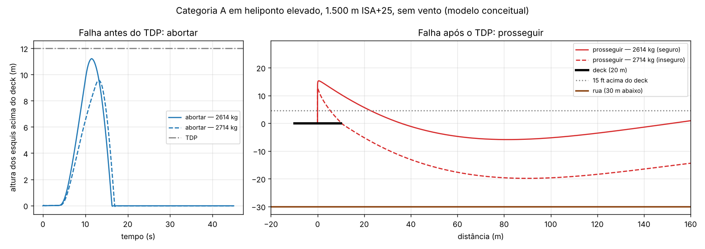

Para o HUD (Passo 4), cada execução fornece:
- massa máxima Cat A da configuração;
- ramo e ação recomendada;
- cronômetro OEI (`rating` e tempo desde a detecção);
- margens de potência OEI;
- perda máxima de altura;
- se o ramo foi seguro e por quê.

### Cenário 4: autorrotação (falha dupla)

Os dois motores param em t = 2 s, a 300 m, MTOW, ISA. O piloto só reage depois do alerta do SADPF e do tempo de reação:
- baixa o coletivo (o coletivo passa a controlar o NR);
- **à frente**: mantém a velocidade de mínima razão de descida e faz o flare;
- **vertical**: sem velocidade, só o amortecimento final com o coletivo.

| | À frente (≈ 70 kt) | Vertical |
|---|---|---|
| Velocidade de mínima razão de descida (método de energia, DERIVADO) | 70 kt | — |
| Razão de descida estabilizada, simulada | **9,9 m/s** | **22,6 m/s** |
| Razão de descida prevista | 10,4 m/s (energia: W·V_z = P_rotor + P_cauda + P_acess.) | 19,9 m/s (momento ideal); a teoria da curva empírica dá ≈ 1,7–1,8·v_h |
| NR antes do amortecimento | 94,7–104,8 % (limites sem motor do TCDS: 85–106 %) | 94,1–102,0 % |
| Toque | **1,2 m/s** vertical, **14,8 m/s** (29 kt) de velocidade no solo, 10,5° nariz acima: pouso corrido | **19,6 m/s**: impacto |

- A comparação mostra por que a autorrotação se faz com velocidade à frente: a razão de descida cai para menos da metade, e a energia cinética permite o flare.
- A vertical a partir de 300 m termina em impacto. Esse é o comportamento esperado da região a evitar do diagrama altura-velocidade para falha total.
- **Flare**: parâmetros ESTIMADOS, escolhidos pela varredura descrita abaixo:
  - começa a 40 m;
  - desaceleração de até 4 m/s², modulada pela razão de descida (alvo de 0,2·(h − 6 m), entre 1,5 e 6 m/s);
  - atitude máxima de 30° nariz acima no flare e de 15° depois dele;
  - amortecimento com o coletivo abaixo de ~6 m, segurando 0,3 m/s de descida.

#### Varredura do flare (ajuste 1)

- **Meta**: toque ≤ 1,5 m/s **e** velocidade no solo ≤ 15 kt, ao mesmo tempo.
- **Prazo**: duas rodadas, **287 combinações**, falha dupla a 150 m.
- **Parâmetros varridos**:
  - altura de início (30–60 m), atitude de cabrar (20–35°), desaceleração do flare (4–8 m/s²) e modulação pela razão de descida;
  - desaceleração e atitude depois do flare;
  - altura, atitude e razão de descida segurada pelo coletivo no amortecimento;
  - referência de NR na planagem (100 % ou 104 %).
- **Resultado: a meta não foi atingida.** Com velocidade vertical ≤ 1,5 m/s, nenhuma combinação válida tocou abaixo de **27,5 kt**. As únicas que tocaram a ≤ 15 kt chegaram ao solo a 9–10 m/s de velocidade vertical.
  - Melhor combinação (novo padrão): **1,44 m/s e 27,5 kt** a partir de 150 m (1,24 m/s e 29 kt a partir de 300 m, com o modelo da deriva), com 10,5–11,9° de nariz acima no toque.
  - O gráfico mostra a fronteira de compromisso: quando a velocidade no solo cai, a velocidade vertical sobe.
- **Achado da varredura**: subir a referência de NR para 104 % na planagem leva o rotor a **115 %** na entrada da autorrotação, acima do limite sem motor de 106 % do TCDS.
  - Todas as 164 combinações com 104 % passaram do limite; o padrão ficou em 100 %.
  - Outras 13 combinações passaram levemente de 106 % (106,2–107,1 %) e também foram descartadas.
  - No total, 110 combinações válidas.
- **Limitação documentada**: o "piloto" do modelo comanda a desaceleração pelo vetor de empuxo e o coletivo pelo NR ou pela razão de descida, de forma desacoplada. Atingir a meta provavelmente exige coordenar cíclico e coletivo no flare (por exemplo, por otimização de trajetória), e isso fica como melhoria.
- Dados: `docs/helicoptero/flare_varredura_r1.json` e `flare_varredura_r2.json`; ferramenta: `tools/heli_flare_sweep.py`.

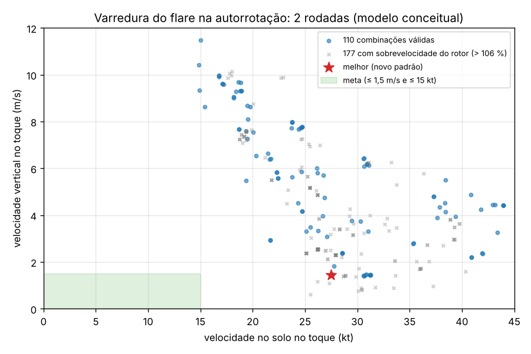

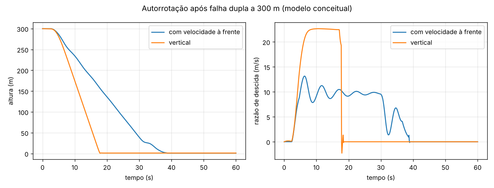

### Falha em torno do TDP (ajuste 3)

> **Errata (05/10/2026, aval do Passo 4).** Os números desta seção foram calculados com um erro de código: o toque do ramo abortar era o quique dos esquis na decolagem, e não o pouso de volta depois da falha. Ficam aqui como registro histórico, **inválidos**. Os valores corrigidos, com o procedimento de abortar v1 (sem amortecimento) e v2 (com amortecimento), estão em [Recálculo após a correção do toque](#recálculo-após-a-correção-do-toque-aval-do-passo-4).

**Convenção padrão (mantida)**:
- a decisão vale no instante em que o SADPF **reconhece** a falha;
- reconhecida antes do TDP: abortar; depois do TDP: prosseguir.

A altura da falha agora é um parâmetro (`cat_a_run(..., fail_rel_tdp_m=...)`), e o ramo pode ser forçado (`force_action`).

**Varredura de −6 m a +6 m em relação ao TDP**, voando os dois ramos em cada altura, nas massas Cat A máximas:

| Falha (m em relação ao TDP) | Nível do mar, ISA, 2.980 kg | 1.500 m, ISA+25, 2.614 kg |
|---|---|---|
| −6 a −2 | SADPF: abortar · abortar seguro · prosseguir inseguro (toca o deck ou cruza a borda < 15 ft) | igual |
| −1,5 | SADPF: abortar (reconhecida 0,3 m antes do TDP) · os dois seguros | SADPF: abortar (0,1 m antes) · abortar seguro · prosseguir inseguro |
| −1,0 e −0,5 | **reconhecida logo após o TDP** (+0,2 e +0,7 m) · SADPF: prosseguir · os dois seguros | reconhecida +0,4 e +0,8 m · SADPF: prosseguir · os dois seguros |
| 0 a +4 | SADPF: prosseguir · os dois seguros | igual |
| +5 e +6 | SADPF: prosseguir · prosseguir seguro · abortar inseguro (tomba ao voltar ao deck com velocidade) | +6: abortar inseguro |

- Nas duas condições, **a ação que o SADPF recomenda é sempre um ramo seguro**.
- Os dois ramos são seguros de −1,5 m a +4 m (nível do mar) e de −1,0 m a +5 m (1.500 m, ISA+25) em relação ao TDP.
- O caso "falha antes do TDP, reconhecida logo depois" (−1,0 e −0,5 m) está coberto e entra no cálculo da massa máxima.
- O tempo entre a falha e o reconhecimento é de ~0,7 s. A 1,5 m/s de subida, isso desloca o ponto de reconhecimento ~1,1 m para cima.

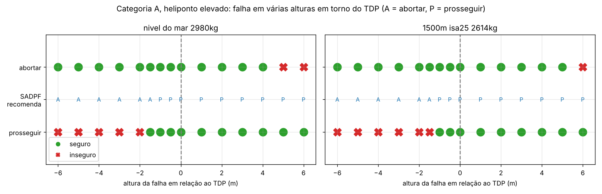

### Diagrama altura-velocidade (ajuste 5)

O [14 CFR 29.59(a)(1)](https://www.ecfr.gov/current/title-14/section-29.59) exige que a trajetória de decolagem Categoria A fique fora do envelope H-V do [§ 29.87](https://www.ecfr.gov/current/title-14/section-29.87). Esse envelope é formado pelas combinações de altura e velocidade, inclusive o pairado, em que não se consegue pouso seguro após a falha do motor crítico.

**Como o modelo levanta o H-V**:
- **Varredura**: 12 alturas (2 a 90 m, altura dos esquis) × 6 velocidades (0 a 60 kt), em voo nivelado.
- **Falha**: o motor 1 apaga em t = 1 s. O SADPF detecta, e o piloto reage 1 s depois do alerta.
- **Manobra**: pouso à frente com um motor (`OeiLanding`).
  - Técnica **"frente"**: aproxima a v_OEI + 3 m/s descendo, depois faz o flare para o efeito solo e amortece com o coletivo. v_OEI é a menor velocidade em que a potência OEI 30 s sustenta voo nivelado (DERIVADO: 9 m/s ao nível do mar no MTOW).
  - Técnica **"vertical"**, a 20 kt ou menos: descida lenta (≤ 1 m/s) direto para o efeito solo e amortecimento.
  - O ponto é seguro se **qualquer** das duas técnicas pousar com segurança.
- **Critério de "pouso seguro"**:

| Grandeza no toque | Limite | Status |
|---|---|---|
| Velocidade vertical | ≤ **2,0 m/s** | DERIVADO: queda livre da altura de 8 in do ensaio de queda do trem, [14 CFR 29.725](https://www.ecfr.gov/current/title-14/section-29.725) (√(2·g·0,203 m) = 2,0 m/s) |
| Velocidade no solo | ≤ 15 kt | ESTIMADO (mesmo valor da meta do flare) |
| Atitude depois do toque | < 15° (sem tombamento) | ESTIMADO |

**Resultado**:

| Condição | Pontos inseguros |
|---|---|
| Nível do mar, ISA, 2.980 kg | **nenhum** (com um motor, a potência OEI 30 s permite pairar dentro do efeito solo); detalhes da margem abaixo |
| 1.500 m, ISA+25, 2.614 kg (massa Cat A) | **pairado de 25 a 30 m**: alto demais para pairar no efeito solo com um motor e baixo demais para ganhar velocidade (45 m já é seguro). Dois pontos isolados no limite: 10 m a 10 kt (2,03 m/s contra 2,0 m/s) e 2 m a 20 kt (toca a 18 kt antes da reação do piloto) |

**Trajetórias Cat A AEO sobrepostas** (velocidade horizontal × altura dos esquis acima da superfície abaixo):

| Trajetória | Fora do H-V? |
|---|---|
| Heliponto no solo, nível do mar, 2.980 kg | **sim** |
| Heliponto elevado de 30 m, nível do mar, 2.980 kg | **sim** |
| Heliponto elevado de 30 m, 1.500 m ISA+25, 2.614 kg | **sim**; passa a uma célula da grade do ponto isolado de 10 m a 10 kt (entre 8 e 10 m de altura, a ~1 kt) |

- A subida vertical até o TDP de 12 m fica abaixo da faixa insegura do pairado (25 a 30 m).
- Ao cruzar a borda do heliponto elevado, a altura sobre a rua salta para mais de 50 m, acima da faixa.
- A grade é grossa: o contorno do H-V tem a resolução de um passo da grade.
- O diagrama depende da técnica de pouso do "piloto" do modelo, cujos parâmetros são ESTIMADOS. Uma técnica melhor só reduziria a região insegura.

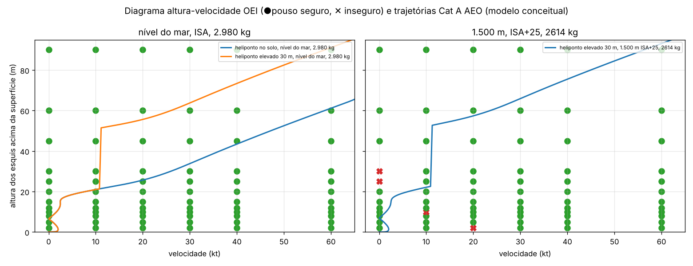

#### Verificações pedidas no aval do Passo 2

**Nível do mar, ISA, 2.980 kg**:
- **Resolução da grade**: 72 pontos.
  - Velocidades: 0, 10, 20, 30, 40 e 60 kt (passo de 10 kt; 20 kt entre 40 e 60).
  - Alturas: 2, 5, 8, 10, 12, 15, 20, 25, 30, 45, 60 e 90 m (passo de 2–3 m até 15 m, 5 m até 30 m, 15–30 m acima).
- **Margem** de cada ponto: a fração do limite de pouso seguro usada no toque, pela grandeza mais crítica (1,0 = no limite), com a melhor técnica.
- **Pior margem**: **10 m a 10 kt**, técnica vertical. Toque a **1,56 m/s** contra o limite de 2,0 m/s: usou **78 %** do limite, e faltaram 0,44 m/s para ficar inseguro.
- Seguem 8 m a 10 kt (67 %) e 2 m a 10 kt (64 %). Nenhum ponto ficou inseguro.
- A região de baixa velocidade em torno de 10 m é a mais próxima de formar um "joelho" de H-V ao nível do mar.

**1.500 m, ISA+25, 2.614 kg, grade refinada em torno de 10 m / 10 kt**:
- **Resolução**: 0 a 20 kt a cada 2,5 kt e 6 a 14 m a cada 0,5 m (153 pontos), 4 vezes mais fina que a grade original nos dois eixos.
- **Região insegura**: uma "ilha" estreita entre **10 e 12,5 kt** e **10 a 12,5 m** (8 pontos). Pousa a mais de 2,0 m/s porque está lenta demais para a aproximação à frente e rápida demais para a descida vertical.
- **Trajetória Cat A AEO**: nessa faixa de altura, ela sobe quase na vertical, a **no máximo 2,5 kt** de velocidade horizontal.
- **Folga**: o ponto mais próximo da trajetória (2,0 kt a 11,6 m) fica a **3,2 passos de grade** do ponto inseguro mais próximo (10 kt a 11,5 m), ou seja, **~8 kt** de folga em velocidade na mesma altura.
- **Conclusão**: a trajetória fica fora da região insegura com folga. O ponto inseguro da grade grossa (10 m / 10 kt) faz parte dessa ilha, que não toca a trajetória.

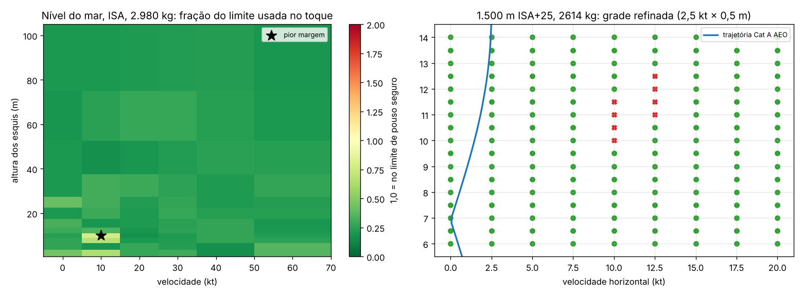

### Validação (Passo 2): `tests/test_helicopter_scenarios.py`, 15 testes

| Teste | Critério |
|---|---|
| Sem alarme falso em voo normal | SADPF no nível 0; pousa a < 5 m do destino |
| Falha de um motor em cruzeiro | nível 3; isola o motor certo; detecção < 1,5 s; recomenda PROSSEGUIR EM OEI |
| Categoria A leve (2.500 kg, nível do mar) | falha antes do TDP → ABORTAR, seguro; falha depois → PROSSEGUIR, seguro, usa OEI 30 s |
| Limite de massa (1.500 m, ISA+25) | 2.550 kg prosseguir seguro; 2.700 kg inseguro, com maior perda de altura; abortar seguro; no MTOW não atinge o TDP |
| VTOSS | existe uma velocidade que atinge 100 ft/min |
| Determinismo | mesma *seed* → mesma trajetória |
| Autorrotação à frente | razão de descida ±15 % do método de energia; NR entre 85 e 106 % antes do amortecimento; toque ≤ 2,5 m/s e ≤ 15 m/s no solo |
| Vertical × à frente | razão de descida > 1,8× e toque > 3× mais forte |
| Velocidade de mínima razão de descida | entre 55 e 85 kt |
| Resgate | pousa a < 5 m; toque ≤ 1,5 m/s; fator de efeito solo < 1; potência menor que fora do efeito solo |
| Critérios de separação | o mesmo voo (2.610 kg, 1.500 m ISA+25) passa no modo `elevado_29_60` e falha no `literal_29_59c` |
| Falha em torno do TDP | falha 3 m abaixo → reconhecida antes → ABORTAR seguro; falha 1 m abaixo → reconhecida depois → PROSSEGUIR seguro |
| H-V | limite de 2,0 m/s conferido com o 29.725; pairado a 10 m com um motor, ao nível do mar → pouso seguro |
| Verificação de trajetória × H-V | regra de célula (dentro só se os 4 vizinhos da grade forem inseguros) |

Números completos em `docs/helicoptero/passo2_resultados.json` e `passo2b_resultados.json` (gerados por `tools/heli_step2_report.py` e `tools/heli_step2b_report.py`).

## Efeito do modelo Fenestron + deriva nos resultados (aval do Passo 2, itens 5–7)

A deriva mudou a física em voo à frente, então a validação e os cenários foram rodados de novo:

| Grandeza | Antes | Depois |
|---|---|---|
| Área de arrasto f (CALIBRADA) | 1,37 m² | **1,50 m²** |
| Pairado OGE, nível do mar, MTOW; teto de pairado; efeito solo | 594 kW; +11,7 %; −15 % | inalterados (a deriva não atua no pairado) |
| V máx. autonomia / alcance | 69 / 102 kt | 69 / 102 kt |
| Potência do Fenestron a 136 kt | ~67 kW | **27 kW** |
| Massas Cat A (10 combinações de condição × critério) | — | **todas idênticas** dentro da resolução de 25 kg da bisseção |
| Cat A no limite (1.500 m ISA+25): perda de altura / descida abaixo do deck | 21,2 / 6,0 m | 21,2 / 5,9 m |
| Autorrotação à frente (300 m): descida / toque | 9,7 m/s; 1,1 m/s a 27 kt | 9,9 m/s; 1,2 m/s a 29 kt |
| Transferência de 20 km: consumo | 23,8 kg | 24,0 kg |
| H-V e varredura de falha × TDP | — | mesmos pontos seguros e inseguros |
| Testes (74) e regressão do drone de Marte | passando | passando |

- A decolagem Categoria A acontece a baixa velocidade, onde a deriva quase não atua. Por isso as massas não mudaram.

## Sensibilidade do antitorque (decisões 1 e 3 do aval do Passo 2)

> **Errata (05/10/2026, aval do Passo 4).** As massas Categoria A desta seção (parte B; as potências e o arrasto da parte A não mudam) foram calculadas com um erro de código: o toque do ramo abortar era o quique dos esquis na decolagem, e não o pouso de volta depois da falha. Ficam aqui como registro histórico, **inválidas**. Os valores corrigidos, com o procedimento de abortar v1 (sem amortecimento) e v2 (com amortecimento), estão em [Recálculo após a correção do toque](#recálculo-após-a-correção-do-toque-aval-do-passo-4).

**Deriva (decisão 1)**:
- A incidência de 6° foi aprovada como ESTIMADO. A área é a da "small fin" do EC135 original (Kampa et al., ERF 1997).
- Variei a parcela do antitorque que a deriva assume a 136 kt de 20 % a 60 %. Em cada caso a incidência foi resolvida para essa parcela e a área de arrasto foi **recalibrada pelo mesmo critério** (136 kt na potência máxima contínua AEO).

| Parcela da deriva a 136 kt | Incidência efetiva | Arrasto calibrado f | V máx. na potência de decolagem | Potência do Fenestron a 136 kt |
|---|---|---|---|---|
| 20 % | 2,8° | 1,44 m² | 142,0 kt | 40,4 kW |
| 30 % | 4,3° | 1,47 m² | 142,0 kt | 34,1 kW |
| 40 % (padrão, 6°) | 5,8° | 1,49 m² | 142,0 kt | 28,1 kW |
| 50 % | 7,4° | 1,52 m² | 142,0 kt | 22,3 kW |
| 60 % | 8,9° | 1,55 m² | 142,0 kt | 16,9 kW |

- A velocidade máxima não muda (142,0 kt em todos os casos): a recalibração de f absorve a diferença.
- Por isso a parcela da deriva **não pode ser identificada** pelos dados de velocidade publicados. Ela só redistribui a potência entre o Fenestron e o arrasto.
- Ela também não afeta as massas Categoria A, porque a decolagem é lenta e a deriva quase não atua.

**Duto do Fenestron (decisão 3)**:
- O ganho de empuxo G = 1,26 = 2^(1/3) é o **máximo teórico** do duto ideal, portanto otimista. Agora G é um parâmetro explícito (ESTIMADO): P_ind = κ·(T/G)^1,5/√(2ρA).
- Valores no MTOW, ISA, nível do mar, com f recalibrada em cada caso:

| G | Fenestron no pairado | Pairado OGE total | Margem AEO de decolagem (616 kW) |
|---|---|---|---|
| 1,10 | 69,3 kW | 606,4 kW | +9,7 kW |
| 1,15 | 65,0 kW | 601,9 kW | +14,2 kW |
| 1,20 | 61,1 kW | 598,0 kW | +18,1 kW |
| 1,26 (ideal) | 57,0 kW | 593,7 kW | +22,4 kW |

- Massas Categoria A (modo 29.60, bisseção de 25 kg), em kg:

| Condição | G = 1,10 | G = 1,15 | G = 1,20 | G = 1,26 | Variação máx. |
|---|---|---|---|---|---|
| nível do mar, ISA | 2.931 | 2.980 | 2.980 | 2.980 | −1,6 % |
| nível do mar, ISA+20 | 2.883 | 2.907 | 2.907 | 2.931 | −1,7 % |
| 1.000 m, ISA+20 | 2.712 | 2.736 | 2.736 | 2.761 | −1,8 % |
| 1.500 m, ISA+25 | 2.566 | 2.590 | 2.590 | 2.614 | −1,9 % |
| 1.500 m, ISA+25, proa 8 m/s | 2.761 | 2.761 | 2.761 | 2.809 | −1,7 % |

- **A variação máxima é de 1,9 %, abaixo do limite de 2 % definido no aval. O padrão continua G = 1,26** (decisão do aval do Passo 3).
  - Justificativa: o teto de pairado do modelo já é **11,7 % pessimista** em relação ao publicado. Usar também um duto conservador empilharia dois conservadorismos sobre a mesma potência de pairado, que é o que limita a decolagem Categoria A.
- **A massa Categoria A passa a ser apresentada como faixa**, de G = 1,15 (limite inferior) a G = 1,26 (padrão): na tabela do raio de ação e no HUD do Passo 4.
- As massas com G = 1,26 recalculadas aqui (com a deriva e o novo modelo de consumo) são idênticas às do Passo 2.
- **Ressalva**: a bisseção tem resolução de 25 kg (~0,9 %), então a variação real fica entre ~1 % e ~2,8 %. O resultado está perto do limite: ver decisão pendente no fim do Passo 3.

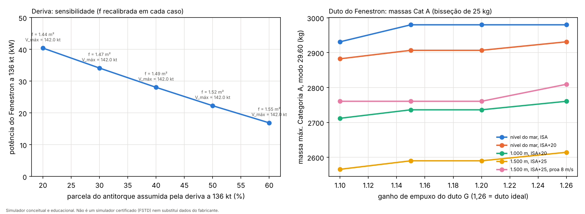

## Modelo de consumo (novo no Passo 3)

O raio de ação depende diretamente do consumo, então conferi o consumo constante usado até aqui (0,36 kg/kWh, ESTIMADO) contra os dados publicados pela Airbus para o tanque padrão. Ele era **otimista**:

| | Publicado (Airbus) | Consumo constante 0,36 kg/kWh | Linha de Willans (padrão) |
|---|---|---|---|
| Autonomia máxima, 560 kg | 3 h 36 min | 5 h 30 min (+53 %) | 3 h 42 min (+2,6 %) |
| Alcance máximo, 560 kg | 342 NM | 448 NM (+31 %) | 333 NM (−2,6 %) |

- **Causa**: o consumo específico de uma turbina piora em potência parcial, e o modelo constante não representa isso.
- **Novo modelo**: linha de Willans, consumo = (vazão a potência zero) × motores em funcionamento + (consumo marginal) × potência.
  - **Forma (ESTIMADO)**: a vazão a potência zero vale 40 % do consumo AEO na potência máxima contínua.
  - **Escala (CALIBRADO)**: mínimos quadrados sobre a autonomia (na velocidade de máxima autonomia) e o alcance (na velocidade de máximo alcance) publicados. Hipóteses: a partir do MTOW, ISA, nível do mar, sem reserva; a Airbus não informa as condições.
  - **Resultado**: 43,3 kg/h por motor a potência zero e 0,229 kg/kWh de consumo marginal. Isso dá 0,38 kg/kWh na potência máxima contínua. Os erros ficam em +2,6 % na autonomia e −2,6 % no alcance.
- **Troca aprovada (aval do Passo 3)**: o modelo prefere **consistência física** a ajuste exato aos dados da Airbus.
  - Com a forma fixa, o alcance por quilo de combustível cai com a massa, como deve ser.
  - O preço é um erro de **±2,6 %** contra a autonomia (+2,6 %) e o alcance (−2,6 %) publicados.
  - O ajuste exato reproduzia os dois números, mas dava um alcance por quilo crescente com a massa, fisicamente errado.
  - A fração de 40 % é ESTIMADO.
- **Por que a forma é fixa**: a primeira versão (entregue na revisão anterior) ajustava os dois coeficientes exatamente aos dois números publicados. As duas velocidades de calibração pedem potências próximas (312 e 373 kW), então essa divisão é mal determinada: deu 64,7 kg/h a potência zero e só 0,092 kg/kWh marginal.
  - Com isso o **alcance específico crescia com a massa**, o que é fisicamente errado.
  - Também ajudava a fazer o raio de ação crescer com altitude e temperatura.
  - **Fração 0,4**: o maior valor testado (0,2 a 0,4) em que o alcance específico ainda cai com a massa, e o que menos erra os dois números. Com 0,2 e 0,3 os erros vão a ±3,6–4,6 %.
- O consumo constante (0,36 kg/kWh) deixa de existir na tabela de parâmetros.
- **Efeito no Passo 2**: as massas Categoria A não mudam (os voos são curtos). O consumo da transferência de 20 km foi recalculado: 22 kg.

## Passo 3: interior UTI, massa e CG, combustível e raio de ação

Código: `src/physics/helicopter/mission.py`. Relatório: `tools/heli_step3_report.py`. Testes: `tests/test_helicopter_mission.py`.

> O orçamento de massa e o CG são do **modelo** e não substituem a pesagem nem o manual de massa e balanceamento de uma aeronave real.

### Configuração UTI padrão

- **Pessoas**: 1 paciente, piloto, médico e enfermeiro.
- **Equipamentos**: lista da Portaria GM/MS nº 2.048/2002 para aeronave de transporte médico de asa rotativa:
  - fixos: respirador mecânico, monitor cardioversor com bateria, oxímetro portátil, bomba de infusão e prancha longa;
  - conjunto aeromédico: maca, ar comprimido e oxigênio para pelo menos 2 h;
  - materiais móveis.
  - **Vigência**: a Portaria GM/MS nº 2.048/2002 **continua vigente como ato autônomo**.
    - A página de legislação do SAMU 192 do Ministério da Saúde (conferida em 04/10/2026) a lista separadamente das Portarias de Consolidação nº 3 e nº 6 de 2017.
    - A matriz de consolidação da Portaria de Consolidação nº 3/2017 (redes do SUS) não a inclui entre as normas consolidadas ou revogadas.
    - Não conferi as matrizes das demais portarias de consolidação.
- **Massas dos equipamentos**: ESTIMADO, exceto as duas com dado público de fabricante:
  - ventilador de transporte classe Hamilton-T1, 6,5 kg (só a unidade);
  - monitor/desfibrilador classe ZOLL X Series, "less than 5.5 kilograms" (usado 5,5 kg).
- **Tripulação**: massa-padrão de tripulante de 85 kg (EASA AMC2 CAT.POL.MAB.100(d), "85 kg for flight crew/technical crew members"). O paciente tem 80 kg (ESTIMADO).
- **Massa vazia**: 1.562 kg, DERIVADA da Airbus (MTOW 2.980 kg − carga útil 1.418 kg).
- **Posições** (STA/BL), CG vazio e posição do tanque: **todos ESTIMADOS**, sem dado público.

<!-- MASSA:BEGIN (gerado por tools/heli_step3_report.py) -->
| Item | Massa (kg) | STA (mm) | BL (mm, + dir.) | Status da massa | Fonte / justificativa |
|---|---|---|---|---|---|
| Massa vazia básica (MTOW 2.980 kg − carga útil 1.418 kg) | 1.562,0 | 4.400 | 0 | **DERIVADO** | https://www.airbus.com/en/products-services/helicopters/civil-helicopters/h135/h135-technical-information (carga útil 1.418 kg); CG vazio ESTIMADO (sem dado público) |
| Piloto (assento dianteiro direito) | 85,0 | 2.450 | 350 | **FONTE** | massa padrão de tripulante técnico/de voo, 85 kg (https://regulatorylibrary.caa.co.uk/965-2012/Content/Document%20Structure/04%20CAT/3%20AMC/AMC2%20CAT%20POL%20MAB%20100%20d%20Mass.htm) |
| Médico (assento de cabine voltado para trás, à direita) | 85,0 | 3.350 | 400 | **FONTE** | massa padrão de tripulante técnico, 85 kg (https://regulatorylibrary.caa.co.uk/965-2012/Content/Document%20Structure/04%20CAT/3%20AMC/AMC2%20CAT%20POL%20MAB%20100%20d%20Mass.htm) |
| Enfermeiro (assento de cabine, à direita, junto à cabeceira) | 85,0 | 3.950 | 400 | **FONTE** | massa padrão de tripulante técnico, 85 kg (https://regulatorylibrary.caa.co.uk/965-2012/Content/Document%20Structure/04%20CAT/3%20AMC/AMC2%20CAT%20POL%20MAB%20100%20d%20Mass.htm) |
| Paciente adulto (na maca, lado esquerdo) | 80,0 | 4.150 | -300 | **ESTIMADO** | adulto de referência; não há massa-padrão de paciente em norma conferida |
| Maca aeromédica com sistema de fixação e embarque (kit aeromédico) | 45,0 | 4.150 | -300 | **ESTIMADO** | item exigido (https://bvsms.saude.gov.br/bvs/saudelegis/gm/2002/prt2048_05_11_2002.html); massa sem dado público de fabricante |
| Plataforma/trilho médico e piso da cabine UTI | 40,0 | 3.900 | 0 | **ESTIMADO** | estrutura do interior aeromédico; sem dado público |
| Ventilador mecânico de transporte (classe Hamilton-T1, só a unidade) | 6,5 | 3.700 | 350 | **FONTE** | 6,5 kg, unidade de ventilação (https://www.hamilton-medical.com/en_US/Products/Mechanical-ventilators/HAMILTON-T1.html) |
| Suporte do ventilador e circuito | 4,0 | 3.700 | 350 | **ESTIMADO** | sem dado público |
| Monitor cardioversor/desfibrilador (classe ZOLL X Series) | 5,5 | 3.800 | 350 | **FONTE** | "less than 5.5 kilograms" — usado o limite de 5,5 kg (https://www.zoll.com/en-gb/products/defibrillators/x-series-for-hospital) |
| Oxímetro portátil | 0,5 | 3.800 | 350 | **ESTIMADO** | item exigido (https://bvsms.saude.gov.br/bvs/saudelegis/gm/2002/prt2048_05_11_2002.html) |
| Bombas de infusão (2) | 4,0 | 3.800 | 350 | **ESTIMADO** | item exigido (https://bvsms.saude.gov.br/bvs/saudelegis/gm/2002/prt2048_05_11_2002.html) |
| Prancha longa | 7,0 | 4.600 | -300 | **ESTIMADO** | item exigido (https://bvsms.saude.gov.br/bvs/saudelegis/gm/2002/prt2048_05_11_2002.html) |
| Oxigênio e ar comprimido (cilindros para ≥ 2 h, reguladores, rede) | 30,0 | 4.700 | 200 | **ESTIMADO** | autonomia de pelo menos 2 h exigida (https://bvsms.saude.gov.br/bvs/saudelegis/gm/2002/prt2048_05_11_2002.html); massa sem dado público |
| Aspirador portátil | 3,0 | 3.800 | 350 | **ESTIMADO** | sem dado público |
| Mochilas/kits de via aérea, acesso venoso, drenagem, parto, EPI | 20,0 | 4.700 | 300 | **ESTIMADO** | materiais exigidos (https://bvsms.saude.gov.br/bvs/saudelegis/gm/2002/prt2048_05_11_2002.html); massa sem dado público |
| Inversor/tomadas 230 V AC e iluminação médica | 6,0 | 4.600 | 0 | **ESTIMADO** | sem dado público |
| **Massa sem combustível** | **2.068,5** | | | | |
| Combustível utilizável, tanque padrão (máx.) | 560 | 4.300 | 0 | **FONTE** (massa) | folheto Airbus; posição do tanque ESTIMADA |
<!-- MASSA:END -->

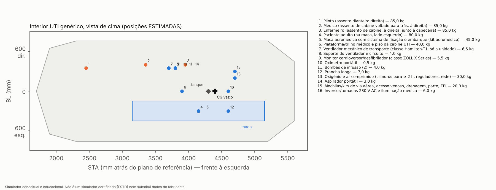

### Decolagem do local de resgate (perfil Resgate, decolagem de volta com o paciente)

> **Errata (05/10/2026, aval do Passo 4).** Os números desta seção foram calculados com um erro de código: o toque do ramo abortar era o quique dos esquis na decolagem, e não o pouso de volta depois da falha. Ficam aqui como registro histórico, **inválidos**. Os valores corrigidos, com o procedimento de abortar v1 (sem amortecimento) e v2 (com amortecimento), estão em [Recálculo após a correção do toque](#recálculo-após-a-correção-do-toque-aval-do-passo-4).

Código: `scenarios.rescue_site_takeoff`. Relatório: `tools/heli_rescue_site_report.py`, que gera `docs/helicoptero/local_resgate.json` e `local_resgate.png`.

**Hipóteses**:
- O local de resgate é **ao nível do solo, plano e sem obstáculos**, na mesma altitude, temperatura e vento da condição de decolagem de origem.
- **Duas massas**:
  - **2.369 kg**: decolagem de volta na missão de raio máximo;
  - **2.601 kg**: missão mais curta, ainda com quase todo o combustível; é o caso mais pesado possível no Resgate com tanque padrão.
- **Procedimento**: o mesmo perfil vertical do procedimento Categoria A, com TDP a 12 m (ESTIMADO), e o mesmo SADPF.

**1. Margem de potência AEO no pairado** (potência de decolagem disponível − requerida):
- IGE com os esquis a 1 m; OGE fora do efeito solo.
- Valores na tabela do raio de ação, de 2.369 a 2.601 kg.
- A menor margem é **+29 kW OGE** a 1.500 m ISA+25 com 2.601 kg.
- O vento de proa não é creditado no pairado.

**2. Capacidade OEI**:
- **Varredura**: falha do motor em 10 alturas, de 1 a 20 m. Em cada uma foram voados os dois ramos (forçados):
  - **abortar** = pousar de volta no local;
  - **prosseguir** = baixar o nariz, acelerar até a VTOSS e subir.
- **Critério de prosseguir**:
  - nunca abaixo de 15 ft acima da superfície depois da falha (14 CFR 29.59(c), aplicado de forma literal porque o local é plano);
  - atingir a VTOSS;
  - subida OEI ≥ 100 ft/min (29.67(a)(1)).
- **Intervalo exposto** = alturas de falha em que nenhum dos dois ramos é seguro.

| Resultado | 2.369 kg (raio máximo) | 2.601 kg (missão mais curta) |
|---|---|---|
| Intervalo exposto | **nenhum**, nas 5 condições | **nenhum**, nas 5 condições |
| Até 3 m | só abortar | só abortar |
| 5 a 17 m | os dois seguros | os dois seguros, exceto a 1.000 m ISA+20 (5 m: só abortar) e a 1.500 m ISA+25 sem vento (5 a 14 m: só abortar) |
| 20 m | só prosseguir (abortar tomba ao voltar com velocidade) | só prosseguir |

- **Achado**: a 1.500 m ISA+25 sem vento, com 2.601 kg, uma falha **entre 11 e 14 m** leva o SADPF a recomendar **prosseguir**, porque já passou o TDP de 12 m.
  - Nesse caso prosseguir toca o solo, enquanto abortar seria seguro.
  - Não há intervalo exposto, mas **o TDP de 12 m é baixo demais** para essa massa e condição: ele precisaria subir para ~17 m, ou a massa de decolagem do local teria de ser limitada.
  - Este é o mesmo mecanismo da massa máxima Categoria A, agora aplicado ao local de resgate.
  - **Decisão do aval**: limitar a massa (abaixo), com o TDP de 12 m como padrão.
- **Duração do intervalo exposto**: zero em todos os casos. A grade de altura tem passos de 1,5 a 3 m, então um intervalo menor que isso poderia passar despercebido.

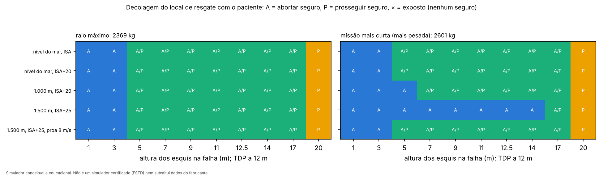

#### Massa máxima de decolagem do local de resgate (padrão: TDP 12 m)

> **Errata (05/10/2026, aval do Passo 4).** Os números desta seção foram calculados com um erro de código: o toque do ramo abortar era o quique dos esquis na decolagem, e não o pouso de volta depois da falha. Ficam aqui como registro histórico, **inválidos**. Os valores corrigidos, com o procedimento de abortar v1 (sem amortecimento) e v2 (com amortecimento), estão em [Recálculo após a correção do toque](#recálculo-após-a-correção-do-toque-aval-do-passo-4).

Código: `scenarios.rescue_site_max_mass`. Relatório: `tools/heli_step3c_report.py A`, que gera `docs/helicoptero/passo3c_resultados.json`.

- **Critério**: a mesma bisseção da massa máxima Categoria A (tolerância de 25 kg), no local plano com o critério literal do 29.59(c). Com o procedimento como voado:
  - uma falha reconhecida antes do TDP tem de ser segura no abortar;
  - falhas em torno do TDP e logo depois dele (−1; −0,5; 0; +2 m em relação ao TDP) têm de ser seguras no ramo que o SADPF recomenda.
- Em todos os casos o limite veio do ramo **prosseguir** logo depois do TDP.
- **Combustível máximo a bordo ao decolar do local** = massa máxima − 2.068,5 kg (massa sem combustível com o paciente).

| Condição | Massa máx. no local, TDP 12 m (padrão) | Combustível máx. no local | TDP 17 m (sensibilidade) | Combustível máx., TDP 17 m |
|---|---|---|---|---|
| nível do mar, ISA | **2.907 kg** | 838 kg | 2.931 kg | 863 kg |
| nível do mar, ISA+20 | **2.834 kg** | 765 kg | 2.883 kg | 814 kg |
| 1.000 m, ISA+20 | **2.663 kg** | 595 kg | 2.688 kg | 619 kg |
| 1.500 m, ISA+25 | **2.517 kg** | 448 kg | 2.541 kg | 473 kg |
| 1.500 m, ISA+25, proa 8 m/s | **2.736 kg** | 668 kg | 2.785 kg | 717 kg |

- Subir o TDP de 12 para 17 m ganha **24 a 49 kg**.
- **Efeito no Resgate com o tanque padrão (560 kg)**:
  - A decolagem de volta no raio máximo (2.369 kg) fica abaixo do limite nas 5 condições: **o raio máximo não muda**.
  - **A 1.500 m ISA+25 sem vento**, a decolagem de volta mais pesada (2.601 kg, missão curta) passa do limite de 2.517 kg. Saindo com o tanque cheio, o local de resgate tem de estar a **pelo menos 51 NM** (36 NM com TDP de 17 m). Para resgates mais perto, a origem tem de abastecer menos, de modo a chegar ao local com no máximo 448 kg.
  - Nas outras 4 condições, o combustível máximo no local (595 a 838 kg) é maior que o tanque padrão: sem restrição.
- **Com o tanque auxiliar (730 kg)**: o limite do local também restringe missões curtas a 1.000 m ISA+20 (595 kg), a 1.500 m ISA+25 (448 kg) e a 1.500 m ISA+25 com vento de proa (668 kg). O raio máximo não muda.

**3. O que a regulamentação diz sobre a classe de desempenho em locais de resgate aeromédico** (só o que foi lido no texto oficial):
- **União Europeia, Regulamento (UE) 965/2012, Anexo V, SPA.HEMS.125** (versão aplicável desde 25/05/2024, [EASA Easy Access Rules for Air Operations](https://www.easa.europa.eu/en/document-library/easy-access-rules/online-publications/easy-access-rules-air-operations?page=50)):
  - (c)(3): *"Helicopters that conduct operations to or from a HEMS operating site located in a hostile environment shall be:"* … *"operated in accordance with performance class 2, or if the conditions defined in point (a) are met, in performance class 3"*.
  - (c)(1), para o heliponto de hospital em ambiente hostil congestionado usado como base: *"shall be operated in accordance with performance class 1"*.
  - O GM1 SPA.HEMS.125(c)(3) diz que *"operations without an assured safe forced landing capability do not need a separate approval"* nesses locais, porque o perfil de risco já é conhecido.
- **Definições** (Reg. 965/2012, Anexo I, texto original de 2012, [legislation.gov.uk](https://www.legislation.gov.uk/eur/2012/965/annexes/adopted/data.xht?view=snippet&wrap=true)):
  - (86) classe de desempenho 2: *"in the event of failure of the critical engine, performance is available to enable the helicopter to safely continue the flight, except when the failure occurs early during the take-off manoeuvre or late in the landing manoeuvre, in which cases a forced landing may be required"*;
  - (85) classe 1: pousar dentro da distância de decolagem rejeitada disponível ou prosseguir com segurança, conforme o momento da falha.
- **Leitura para o modelo**: a regra europeia não exige classe 1 no local de resgate em ambiente hostil, mas classe 2 (ou 3 sob condições), aceitando uma janela inicial de exposição. O resultado do modelo (nenhum intervalo exposto com este procedimento e estas massas) é **mais exigente** que a classe 2.
  - Isso é uma comparação de critérios, não uma conclusão de conformidade.
  - Não li os textos de CAT.POL.H.305 nem das demais condições do (a), então não afirmo nada sobre eles.
- **Brasil**:
  - O RBAC 90 (Emenda 02, operações especiais de aviação pública, inclusive aeromédicas) **não menciona "classe de desempenho"** nem requisitos de falha de motor na decolagem, segundo a leitura do texto oficial. Ele trata de pouso e decolagem em local não cadastrado na seção 90.301.
  - Da RBAC 135 (Emenda 15) só consegui ler o texto até a seção 135.128, então **não afirmo** se ela tem regra de classe de desempenho para operação aeromédica.
  - **Lacuna registrada.**

### Previsão de ramos: função consultiva do SADPF (CONSULTIVO · conceitual · não certificado)

> **Errata (05/10/2026, aval do Passo 4).** Os números desta seção foram calculados com um erro de código: o toque do ramo abortar era o quique dos esquis na decolagem, e não o pouso de volta depois da falha. Ficam aqui como registro histórico, **inválidos**. Os valores corrigidos, com o procedimento de abortar v1 (sem amortecimento) e v2 (com amortecimento), estão em [Recálculo após a correção do toque](#recálculo-após-a-correção-do-toque-aval-do-passo-4).

Código: `src/physics/helicopter/advisory.py` (`BranchPredictor`), ligado ao `CatATakeoff` (`cat_a_run(..., advisory=True)`). Relatório: `tools/heli_step3c_report.py B`.

- **O que faz**: no instante em que o SADPF detecta a falha do motor, copia o estado atual da simulação e voa, mais rápido que o tempo real, os dois ramos: **abortar** e **prosseguir**. Cada ramo previsto é julgado com o mesmo critério do cenário (`evaluate_cat_a`: 29.60 no heliponto elevado, 29.59(c) literal no local de resgate).
- **Alerta**: se o ramo que o procedimento indica (antes ou depois do TDP) é previsto **inseguro** e o outro **seguro**, emite um alerta consultivo destacado (evento `branch_prediction`, nível 2), com o rótulo **"CONSULTIVO · conceitual · não certificado"**.
- **O procedimento continua sendo o padrão**: o alerta só é exibido. O "piloto" só segue o alerta quando isso é pedido explicitamente (`follow_advisory=True`), o que serve para medir o que a função mudaria.
- **Método da previsão** (parâmetros de projeto, ESTIMADOS):
  - passo de integração de 0,05 s no ar (o cenário usa 0,005 s) e controle a 20 Hz;
  - passo de 0,01 s perto do contato com o solo (abaixo de 0,3 m de altura dos esquis mais 0,3 s da razão de descida atual), porque os esquis são uma mola-amortecedor rígida;
  - a previsão para assim que o ramo está decidido: abortar, 1 s depois de assentar nos esquis; prosseguir, ao tocar o solo ou ao atingir 95 % da VTOSS subindo; no máximo 25 s.
- **Cálculo dos dois ramos em paralelo** (decisão do aval do Passo 3): dois processos de trabalho, iniciados e aquecidos antes da decolagem (não na falha). No instante da detecção, o estado da simulação (~74 kB) é copiado para os dois, e cada um voa um ramo. O tempo medido inclui essa cópia. Onde não é possível abrir processos, a previsão roda em sequência e o HUD indica o modo. O teste `test_parallel_equals_sequential` confere que os dois modos dão a mesma previsão.
- **Tempo de cálculo**, comparado com o tempo de reação de 1 s. Medido no relógio, nos 130 casos da varredura abaixo, um caso de cada vez numa máquina sem outra carga. **Os tempos foram medidos em ambiente de desenvolvimento (contêiner Linux com 2 núcleos) e não representam hardware embarcado.**

| Métrica | Em paralelo (padrão) | Em sequência (Passo 3) |
|---|---|---|
| Média | **0,49 s** | 0,63 s |
| p95 | **0,70 s** | 0,76 s |
| Máximo | **0,94 s** (130 de 130 casos dentro de 1 s) | 0,90 s |

  - **O máximo em paralelo ficou acima da estimativa de 0,72 s** feita no Passo 3. Aquela estimativa tomava o ramo mais lento medido sozinho. Com os dois ramos rodando ao mesmo tempo nos 2 núcleos, cada ramo fica mais lento (soma dos dois em paralelo: média 0,71 s, máximo 1,10 s), e a cópia do estado acrescenta ~10 ms.
  - Os dois casos mais lentos (0,94 e 0,91 s) são falhas a 20 m no local de resgate. Ali o ramo abortar precisa prever ~17 s de descida. A média e o p95 caíram bem; o pior caso continua com folga de só ~6 %.
  - O HUD mostra, em cada falha, o tempo medido e o modo (paralelo ou sequencial).
  - Uma primeira versão (passo de 0,05 s abaixo de 2 m e verificação a cada 0,5 s) levava até 1,67 s e passava de 1 s em 17 casos. O passo fino só perto do contato resolveu isso sem perder acerto.
- **Varredura de falhas em torno do TDP com a função**: 130 casos.
  - Heliponto elevado: 2 × 15 alturas de falha (2.980 kg ao nível do mar; 2.614 kg a 1.500 m ISA+25).
  - Local de resgate: 5 condições × 2 massas (2.369 e 2.601 kg) × 10 alturas.
  - A referência ("verdade") são os dois ramos forçados, voados com a simulação completa.

| Resultado | Casos |
|---|---|
| Previsões corretas (os dois ramos) | **130 de 130** |
| Procedimento inseguro e o outro ramo seguro | 3 |
| Alertas emitidos | 3 (todos corretos; nenhum alerta errado) |
| **Resultado mudado seguindo o alerta** | **3, todos de inseguro para seguro**; nenhum de seguro para inseguro |
| Casos perdidos (procedimento inseguro sem alerta) | 0 |
| Casos sem nenhum ramo seguro | 0 |

- **Os 3 casos**: local de resgate a 1.500 m ISA+25 sem vento, com 2.601 kg, falha a −1,0; +0,5 e +2,0 m do TDP. O SADPF indica prosseguir (falha reconhecida já no TDP ou depois dele); prosseguir toca o solo; a função prevê isso e aconselha abortar, que é seguro.
- **Com a limitação de massa padrão** (2.517 kg nessa condição), esses 3 casos não acontecem: a função é uma segunda camada, não substitui a limitação.
- **Limites**: a previsão usa o mesmo modelo que a "verdade". O acerto de 130/130 mede só a fidelidade da integração rápida, não o acerto em relação a um helicóptero real. Não há incerteza de estado, de vento nem de massa na previsão.

### Envelope de CG e verificação no início e no fim do voo

- **Envelope**: [TCDS EASA R.009](https://www.easa.europa.eu/en/downloads/7943/en), seção do EC135 T3H.
  - Dianteiro: 4.180 mm a 1.840 kg → 4.237,5 mm a 3.175 kg.
  - Traseiro: 4.570 mm a 1.500 kg → 4.349 mm a 3.175 kg.
  - Lateral: ±100 mm.
  - Plano de referência (STA 0): 2.160 mm à frente do ponto de nivelamento no batente da porta dianteira.
  - Usei retas entre os pontos publicados (o TCDS pode ter mais pontos intermediários) e limite dianteiro constante abaixo de 1.840 kg (suposição).
- **Verificação**: CG na decolagem de origem (combustível máximo), na decolagem de volta (depois da ida, com a troca de carga) e no fim do voo (só a reserva de 20 min), nos três perfis. **Todos dentro do envelope**. Valores na condição ao nível do mar, ISA:

| Perfil · estado | Massa | CG longitudinal | Margem dianteira | Margem traseira | CG lateral |
|---|---|---|---|---|---|
| Resgate · decolagem | 2.548 kg | 4.252 mm | 41 mm | 180 mm | 40 mm dir. |
| Resgate · decolagem de volta | 2.369 kg | 4.243 mm | 40 mm | 212 mm | 33 mm dir. |
| Resgate · fim (reserva) | 2.119 kg | 4.236 mm | 44 mm | 252 mm | 37 mm dir. |
| Transferência · decolagem | 2.628 kg | 4.249 mm | 35 mm | 173 mm | 30 mm dir. |
| Transferência · decolagem de volta | 2.288 kg | 4.246 mm | 47 mm | 220 mm | 45 mm dir. |
| Transferência · fim (reserva) | 2.038 kg | 4.240 mm | 51 mm | 259 mm | 50 mm dir. |
| Conservador · decolagem | 2.628 kg | 4.249 mm | 35 mm | 173 mm | 30 mm dir. |
| Conservador · fim (reserva) | 2.119 kg | 4.236 mm | 44 mm | 252 mm | 37 mm dir. |
| Tanque auxiliar (730 kg) · decolagem com paciente | 2.798 kg | 4.252 mm | 30 mm | 147 mm | 28 mm dir. |

- **Ponto crítico**: o limite **dianteiro**, com 30–35 mm de folga. A tripulação vai na frente; o paciente e a maca ficam perto do eixo do rotor.
- **CG vazio de 4.400 mm**: aprovado como ESTIMADO. Faixa válida: a configuração UTI fica dentro do envelope em todos os estados verificados para qualquer CG vazio entre **4.345 e 4.690 mm**. Abaixo de 4.345 mm ela passaria do limite dianteiro.

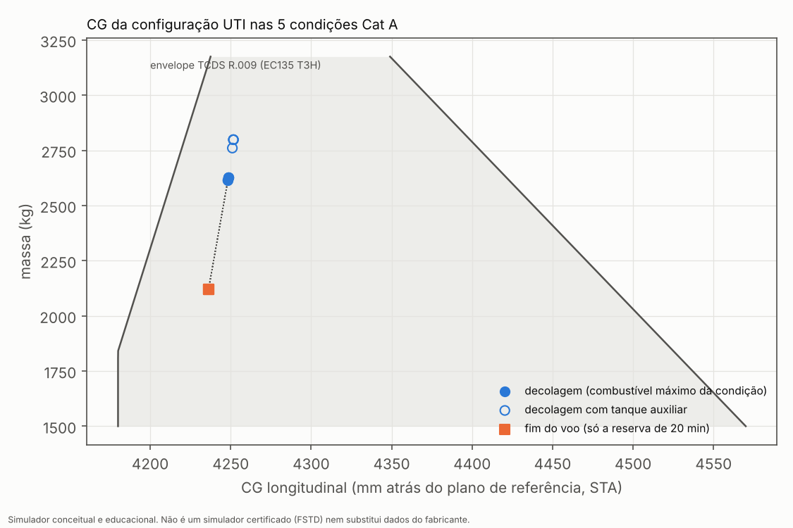

### Combustível máximo e raio de ação em cada condição Categoria A

> **Errata (05/10/2026, aval do Passo 4).** Os números desta seção foram calculados com um erro de código: o toque do ramo abortar era o quique dos esquis na decolagem, e não o pouso de volta depois da falha. Ficam aqui como registro histórico, **inválidos**. Os valores corrigidos, com o procedimento de abortar v1 (sem amortecimento) e v2 (com amortecimento), estão em [Recálculo após a correção do toque](#recálculo-após-a-correção-do-toque-aval-do-passo-4).

**Separação dos efeitos** (decisão do aval do Passo 3):
- A **condição de decolagem Categoria A** define **só o combustível embarcável**: o menor entre (massa máxima Cat A − massa sem combustível na decolagem) e a capacidade do tanque.
- O **cruzeiro de todos os casos** é feito numa **condição de referência comum: ISA, 1.000 ft acima do nível do mar**. Os pousos e decolagens das pontas também usam a condição de referência.
- Antes, o cruzeiro rodava na altitude e temperatura da decolagem: a velocidade sentia a densidade, mas o consumo não. Por isso o raio crescia com a altitude, o que era um artefato do modelo.
- O efeito de altitude e temperatura no consumo entrou no backlog.

**Perfis de missão** (`mission.PROFILES`), configuração UTI padrão:

| Perfil | Ida | Volta | Massa sem combustível na decolagem de origem |
|---|---|---|---|
| **Resgate (padrão)** | sem paciente | com paciente | 1.988,5 kg |
| Transferência | com paciente | sem paciente | 2.068,5 kg |
| Conservador | com paciente | com paciente | 2.068,5 kg |

- **Pousos e decolagens das pontas na condição de referência** (aprovado). O efeito foi medido: em pairado na condição Cat A em vez da referência, a decolagem de origem e o pouso final (3 min cada) consumiriam a mais 0 kg (nível do mar, ISA), 0,15 kg (ISA+20), 0,4 kg (1.000 m ISA+20) e 0,6 kg (1.500 m ISA+25). Com a outra ponta na mesma condição, isso dobra para até ~1,2 kg, menos de 0,3 NM de raio.
- A restrição Categoria A vale na **decolagem de origem**, na condição configurada.
- No perfil Resgate, o paciente embarca na outra ponta. A decolagem de volta também respeita a **massa máxima do local de resgate (TDP 12 m)**, aplicada como padrão em `catA_fuel_and_radius(..., site_limit_kg=...)`: se a decolagem de volta passar do limite, o combustível da origem é reduzido por bisseção (o raio cai junto).

**Missão**:
- partida e táxi: 8 kg (ESTIMADO);
- decolagem e pouso em cada ponta: 3 min na potência de pairado cada (ESTIMADO);
- cruzeiro na velocidade de máximo alcance da massa atual (91,5 kt na referência), sem vento;
- **reserva final de 20 min no consumo normal de cruzeiro**, pela [RBAC 91.151(b)](https://pergamum.anac.gov.br/pergamum/vinculos/RBAC91EMD08.pdf) da ANAC (Emenda 08): *"Somente é permitido começar um voo VFR em um helicóptero se, considerando vento e condições meteorológicas conhecidas, houver combustível e óleo suficiente para voar até o local previsto para primeiro pouso e, assumindo consumo normal de cruzeiro, voar mais, pelo menos, 20 minutos."*
- **Comparação**: a [14 CFR 135.209(b)](https://www.law.cornell.edu/cfr/text/14/135.209) da FAA pede os mesmos 20 min.
- **Lacuna (mantida)**: a RBAC 135 (Emenda 15) tem a seção "135.209 Autonomia para voo VFR" no índice da Subparte D, mas **não consegui ler o texto**. A RBAC 91.151(b) fica como padrão **provisório**.
  - O PDF oficial, pelo caminho `arquivos/` e pelo caminho `pergamum/vinculos/`, só me entregou o texto até a seção 135.128.
  - A página HTML da Emenda 12 na ANAC também parou antes da Subparte D.
  - O download do PDF pela linha de comando foi bloqueado pela rede deste ambiente.
  - Se você puder anexar o PDF, eu extraio a seção localmente. Se a 135.209 exigir mais para helicópteros, ela passa a ser o padrão.
  - **Indício, não fonte confirmada**: segundo o autor do projeto, uma cópia secundária da RBAC 135 Emenda 13 (Scribd) indica que a 135.209(b) exige, para helicóptero VFR, combustível até o destino mais 20 minutos em consumo normal de cruzeiro, igual à RBAC 91.151(b). Fica registrado só como indício até a leitura do PDF oficial da Emenda 15.

**Raio de ação, tanque padrão (560 kg)**. A massa Cat A aparece como faixa G 1,15–1,26; o raio entre parênteses é o do limite inferior quando difere.

| Condição de decolagem | Massa máx. Cat A (G 1,15–1,26) | Resgate (padrão) | Transferência | Conservador | Decolagem do local de resgate (Resgate, com paciente): massa máx. TDP 12 m (17 m) e efeito |
|---|---|---|---|---|---|
| nível do mar, ISA | 2.980 kg | 141 NM · 560 kg (tanque) | 141 NM · 560 kg (tanque) | 140 NM · 560 kg (tanque) | **2.907 kg** (2.931); sem restrição. AEO: +157 a +205 kW (IGE), +116 a +169 kW (OGE) |
| nível do mar, ISA+20 | 2.907–2.931 kg | 141 NM · 560 kg (tanque) | 141 NM · 560 kg (tanque) | 140 NM · 560 kg (tanque) | **2.834 kg** (2.883); sem restrição. AEO: +150 a +199 / +107 a +162 kW |
| 1.000 m, ISA+20 | 2.736–2.761 kg | 141 NM · 560 kg (tanque) | 141 NM · 560 kg (tanque) | 140 NM · 560 kg (tanque) | **2.663 kg** (2.688); sem restrição com o tanque padrão. AEO: +115 a +167 / +69 a +128 kW |
| 1.500 m, ISA+25 | 2.590–2.614 kg | 141 NM · 560 kg (tanque) | **137 NM** (129) · 546 kg (massa Cat A) | **136 NM** (129) · 546 kg (massa Cat A) | **2.517 kg** (2.541): raio máximo inalterado, mas com tanque cheio o local tem de estar a **≥ 51 NM** (36 NM); mais perto, abastecer menos (≤ 448 kg no local). AEO: +76 a +131 / **+29** a +90 kW |
| 1.500 m, ISA+25, proa 8 m/s | 2.761–2.809 kg | 141 NM · 560 kg (tanque) | 141 NM · 560 kg (tanque) | 140 NM · 560 kg (tanque) | **2.736 kg** (2.785); sem restrição com o tanque padrão. AEO: +76 a +131 / +29 a +90 kW (vento não creditado no pairado) |

- Tempo de voo de ~2 h 59 min; reserva de ~50 kg.
- **Com o cruzeiro em condição comum, o raio só muda quando a massa Cat A limita o combustível.** Isso só acontece a 1.500 m ISA+25 sem vento, nos perfis que saem com o paciente.
  - Com G = 1,15, nesses dois perfis, embarcam 522 kg e o raio cai para 129 NM.
  - No Resgate, a origem sai 80 kg mais leve e leva o tanque cheio.
- **O efeito do paciente (80 kg) sobre o raio é pequeno**, de 0,3 NM entre Resgate e Conservador. Ele aparece de verdade quando a massa Cat A limita o combustível.
- **Com tanque auxiliar** (730 kg, folheto Airbus): Resgate, 192 NM em todas as condições menos 1.500 m ISA+25 sem vento (626 kg, limitado pela massa Cat A, 161 NM). Transferência e Conservador: 192 NM ao nível do mar e com vento de proa; 180 NM a 1.000 m ISA+20 (692 kg); 136–137 NM a 1.500 m ISA+25 (546 kg).

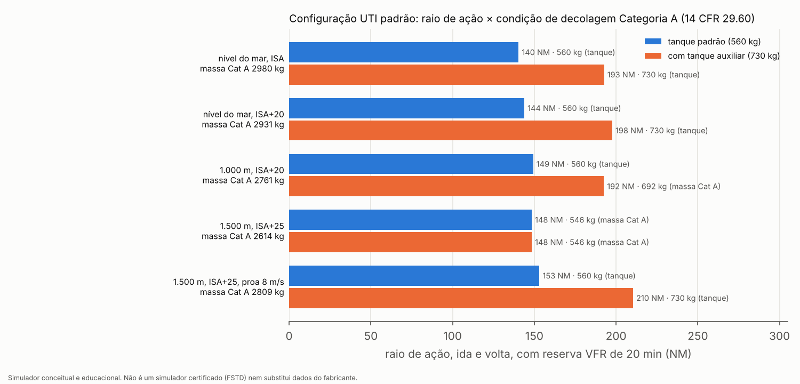

### O que é ESTIMADO no Passo 3

- **Posições**: CG vazio, tanque e posição de todos os itens.
- **Massas**: dos equipamentos (exceto ventilador e monitor), da maca e do interior, do paciente.
- **Missão**: táxi e tempo de decolagem/pouso. A condição de referência do cruzeiro (ISA, 1.000 ft) é uma decisão de projeto do aval, não um dado.
- **Consumo**: forma da linha de Willans (40 % em potência zero).
- **Envelope de CG**: forma linear entre os pontos publicados do TCDS.
- **Local de resgate**: TDP de 12 m (17 m na sensibilidade), local plano, sem obstáculos, na mesma condição da origem.
- **Previsão de ramos**: passos de integração, critérios de parada e horizonte da previsão (parâmetros de projeto).

### Validação (Passo 3): `tests/test_helicopter_mission.py`, 10 testes, e `tests/test_helicopter_advisory.py`, 7 testes

| Teste | Critério |
|---|---|
| Modelo de consumo | autonomia e alcance publicados dentro de ±3 % |
| Alcance específico | cai com a massa (300 kg a mais → menos NM por kg) |
| Orçamento e envelope | soma das massas; CG dentro com 0, 50 e 560 kg; pontos do TCDS reproduzidos |
| Fontes dos itens FONTE | todos com link |
| Combustível limitado pela massa Cat A | combustível = massa Cat A − massa sem combustível; raio cresce com o combustível; CG dentro nos três estados |
| Cruzeiro comum | o mesmo combustível dá o mesmo raio em condições de decolagem diferentes |
| Perfis | Conservador ≤ Resgate e Transferência; troca de carga no sentido certo |
| Reserva | 20 min (RBAC 91.151(b) / 14 CFR 135.209(b)); raio positivo |
| Massa de decolagem do local de resgate | a da missão mais curta é maior que a do raio máximo |
| Decolagem do local de resgate (nível do mar, 2.369 kg) | margens AEO positivas, IGE > OGE; a 3 m só abortar; a 9 m os dois ramos seguros; sem intervalo exposto |
| Previsão de ramos: alerta | 1.500 m ISA+25, 2.600,7 kg, falha a +0,5 m do TDP: procedimento = prosseguir, previsto inseguro; alerta aconselha abortar; rótulo "não certificado" |
| Previsão de ramos: procedimento padrão | só exibindo o alerta, o ramo voado continua sendo prosseguir (e toca o solo) |
| Previsão de ramos: seguir o alerta | abortar voado e seguro |
| Previsão de ramos: sem alerta | falha 5 m abaixo do TDP: procedimento abortar, sem alerta |
| Previsão de ramos: tempo | medido e registrado; limite frouxo de 5 s no teste (máquinas de CI compartilhadas); o limite de 1 s é verificado no relatório |
| Limite de massa do local no raio | raio máximo inalterado com 2.517 kg; combustível máx. no local = limite − massa sem combustível; raio mínimo com tanque cheio entre 30 NM e o raio máximo |
| Limite de massa do local ativo | com um limite abaixo da decolagem de volta, o combustível da origem cai e o raio também |

### Decisões do aval do Passo 3 (22:41) e o que falta

1. **Massa do local de resgate**: limitação de massa adotada como padrão (TDP 12 m), com TDP 17 m como sensibilidade.
2. **Previsão de ramos**: implementada como consultiva; o procedimento segue sendo o padrão.
3. **Reserva**: RBAC 91.151(b) (20 min) segue como padrão provisório. A indicação da Emenda 13 (Scribd) está registrada só como indício. **Aguardando o PDF oficial da Emenda 15** para extrair a 135.209 e confirmar.

## Passo 4: HUD e cenas do Template A

Página: `web/heli/` (rota `/heli/` do `simulation_server.py`, ou qualquer servidor estático na pasta). A rota nova do servidor não foi exercitada neste ambiente, que não tem `flask_socketio` nem `flask_sqlalchemy`; a página foi testada com um servidor estático, pelo script de capturas. Telemetria: `tools/heli_scenes_export.py` gera `web/heli/data/*.json`. Capturas: `tools/heli_hud_capture.py` gera `docs/screenshots/heli_*.png` (1920 × 1080).

- **A cena só reproduz o que o Twin calculou.**
  - Posição, atitude, NR, torque por motor, regime e cronômetro OEI, margem de potência, combustível, eventos do SADPF e a previsão de ramos vêm da simulação física, gravados a cada 0,1 s.
  - A página interpola entre os registros e desenha.
  - Os instantes das capturas também saem da telemetria: falha, detecção, previsão, profundidade máxima abaixo do deck e toque.
  - O rodapé diz isso: *"Terreno ilustrativo · voo, falha e respostas calculados pelo Twin (não é animação)"*, como no drone.
- **Sempre visível**: o aviso *"Simulador conceitual e educacional. Não é um simulador certificado (FSTD) nem substitui dados do fabricante."*
- **Helicóptero**: modelo 3D genérico, montado por código, sem logotipo, matrícula nem pintura de fabricante. Tem rotor principal de 4 pás com raio do modelo (5,1 m), rotor de cauda carenado tipo Fenestron com duto de 1,0 m (TCDS) e 10 pás, deriva, estabilizador com placas, carenagem de dois motores e esquis.
- **Cenário**: ilustrativo. O heliponto elevado tem as dimensões do modelo (deck de 20 m × 20 m a 30 m da rua). Em frente ao deck não há obstáculos, como no modelo: o critério usa o solo como obstáculo. O local de resgate é plano.
- **Estilo**: o mesmo do vídeo do drone em Marte: título no canto superior esquerdo, relógio T+ no direito, painel SADPF à esquerda, telemetria à direita, legenda inferior e rodapé.
- **Painel de telemetria**:
  - NR, torque por motor e regime OEI com o limite, cronômetro OEI (30 s → 2 min), IAS, Vz, altura dos esquis, margem de potência, alerta de VRS, massa, CG, combustível e autonomia, além do diagrama H-V com a posição atual;
  - o Ng aparece como **"não modelado"**;
  - torque % = P / (P100 × NR) (DERIVADO, com P100 = 665 N·m × 5.898 rpm);
  - limites por regime de `engine_limit_w`.

### Cenas

| Cena | Conteúdo | Capturas |
|---|---|---|
| (a) Categoria A, heliponto elevado, falha de motor | 1.500 m, ISA+25, **2.373 kg** (massa máxima Cat A com G = 1,26 e o abortar v2, padrão; atualizado em 05/10/2026 após a correção do toque). Três execuções do Twin: abortar v2 (falha 3 m antes do TDP; toque a 1,3 m/s), prosseguir (falha 0,5 s depois do TDP) e abortar v1 na mesma massa como referência conservadora (toque a 1,9 m/s: reprovado pelo critério de 1,5 m/s, embora abaixo do limite estrutural de 2,0 m/s). Painel Cat A: massa máxima **como faixa 2.356–2.373 kg (duto G 1,15–1,26)**, com o v1 ao lado (2.322–2.339 kg); critério 29.60 com o **29.59(c) literal ao lado**; profundidade da descida abaixo do deck; margens OEI; cronômetro OEI e torque por motor. | `heli_a1_categoria_a_abortar.png`, `heli_a1b_categoria_a_abortar_v1_referencia.png`, `heli_a2_categoria_a_prosseguir.png`, `heli_a3_categoria_a_prosseguir_vtoss.png` |
| (b) Alerta consultivo da previsão de ramos | Atualizado em 05/10/2026: o caso é o primeiro alerta do local de resgate na conferência dos 130 casos com o abortar v2. Local de resgate, 1.000 m, ISA+20, 2.601 kg, falha 5 m abaixo do TDP: o procedimento indica abortar, que toca a 2,4 m/s; prosseguir é seguro. A cena diz que a massa está acima do limite do local (2.508 kg) e que é um caso de demonstração. O alerta tem moldura e cor próprias (âmbar), diferentes do SADPF (vermelho), com o rótulo **"CONSULTIVO · conceitual · não certificado"**, os dois ramos previstos e o **tempo de cálculo medido** naquela falha. Duas execuções: o procedimento como padrão (abortar, reprovado) e o piloto seguindo o alerta (prosseguir, seguro). | `heli_b1_previsao_alerta.png`, `heli_b2_previsao_alerta_seguido.png` |
| (c) Autorrotação: vertical × com velocidade à frente | Tela dividida, falha dos dois motores a 300 m (2.980 kg, nível do mar ISA). Razão de descida ao vivo e em regime (Twin e teoria): 22,6 × 9,9 m/s. Toque: 19,6 m/s na vertical (impacto) × 1,2 m/s com 29 kt no solo à frente. A **limitação do flare** fica escrita na cena. | `heli_c1_autorrotacao_descida.png`, `heli_c2_autorrotacao_toque.png` |
| (d) Painel de missão | Seleção de perfil (Resgate, Transferência, Conservador) e de condição. Mostra combustível e o que o limita, raio de ação (com G 1,15 quando difere), tempo de voo e reserva, decolagens de volta, **massa máxima no local de resgate (TDP 12 m; 17 m)**, combustível máximo no local e a **restrição de distância mínima** (≥ 51 NM com tanque cheio a 1.500 m ISA+25; 36 NM com TDP de 17 m). | `heli_d_painel_missao.png` |

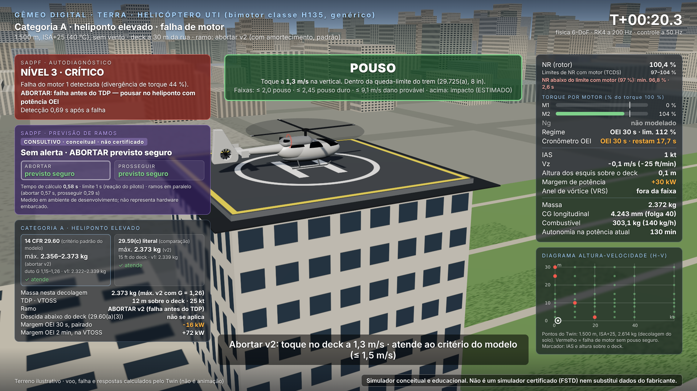
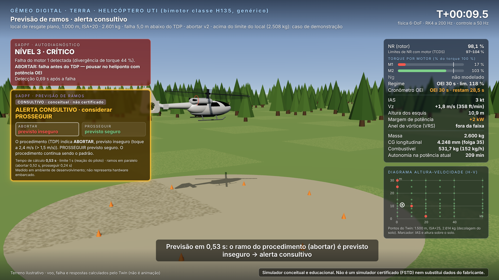
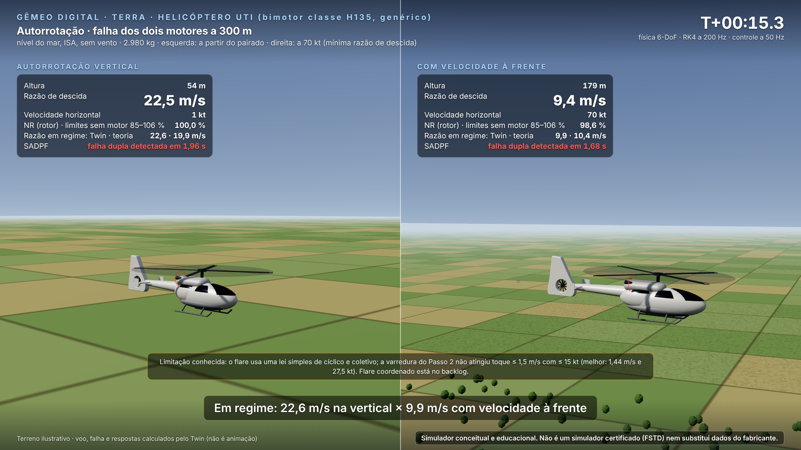

**Como rodar**:
```bash
python -m tools.heli_scenes_export     # telemetria das cenas (~1,5 min; rode com a máquina sem outra carga, por causa do tempo da previsão)
python -m tools.heli_hud_capture       # capturas em docs/screenshots/ (Chromium headless)
python simulation_server.py            # e abra http://localhost:5000/heli/ (cenas, ramos, linha do tempo, velocidade)
# sem o servidor completo: python -m http.server -d web/heli 8000  e abra http://localhost:8000/
```

### Validação (Passo 4): `tests/test_helicopter_hud.py`, 8 testes

| Teste | Critério |
|---|---|
| Aviso e rodapé | o texto exato do aviso e o rodapé estão na página e nenhuma cena os esconde; rótulo consultivo e nota de ambiente de desenvolvimento presentes |
| Sem marcas | nenhum nome de fabricante na página nem nos dados das cenas |
| three.js | biblioteca local (sem CDN) com a licença MIT |
| Cat A | os dois ramos seguros pelo 29.60; literal 29.59(c) exportado; faixa G 1,15 ≤ 1,26; massa da cena = máxima com G 1,26; colunas com o mesmo tamanho; OEI depois da falha; torque do motor parado < 5 % e do outro > 50 % |
| Alerta | alerta, procedimento = prosseguir, conselho = abortar, rótulo "não certificado", modo paralelo, tempo ≤ 1 s; procedimento inseguro e alerta seguido seguro; massa acima do limite do local indicada |
| Autorrotação | razão vertical > 1,8 × a com velocidade à frente; toque vertical mais forte; velocidade no solo acima da meta (limitação do flare) |
| Missão | três perfis; a 1.500 m ISA+25 a restrição de distância mínima > 30 NM e combustível máximo no local coerente; ao nível do mar sem restrição |
| Paralelo = sequencial | mesma previsão (seguro, motivo e duração prevista) nos dois modos |

### O que é ESTIMADO ou ilustrativo no Passo 4

- **Cenário 3D**: cidade, árvores, montanhas e terreno são ilustrativos. As dimensões do deck e do local vêm do modelo.
- **Modelo 3D**: geometria aproximada da classe, sem pretensão de forma exata. Usa o raio do rotor e o diâmetro do duto do modelo.
- **Câmeras e cores**: escolhas de apresentação.
- **Cena (c)**: usa a massa padrão do modelo (MTOW, 2.980 kg), não a configuração UTI. O CG não é mostrado nessa cena.

### Decisões que precisam do seu aval (Passo 4)

1. **Tempo da previsão em paralelo**: máximo medido de 0,94 s, contra a estimativa de 0,72 s (ver acima). Cabe em 1 s nos 130 casos, mas com só ~6 % de folga no pior caso. Se quiser mais folga, o caminho é limitar o horizonte do ramo que o procedimento não indica, ou usar passo adaptativo na descida longa do abortar.
2. **Capturas**: 8 imagens em `docs/screenshots/`, incluindo duas a mais que o pedido (a3 e d). Diga se quer outros instantes ou enquadramentos.
3. **Próximo passo**: Template B (classe UH-60), conforme o roteiro.

## Correções do aval do Passo 4

### Achado: o toque do ramo abortar era medido no contato errado (erro de código, corrigido)

- **O erro.** Em `procedures.evaluate_cat_a`, o toque do ramo abortar era o *primeiro contato com o solo depois de a aeronave sair do chão*. Na decolagem, os esquis quicam uma vez (≈ 0,3 s). Esse quique era tomado como o "toque", com ~0,2 m/s. O toque real, de volta ao deck depois da falha, nunca era avaliado.
- **Correção.** O toque passa a ser o primeiro contato depois de a aeronave ficar 1 s no ar e depois da falha do motor.
- **Efeito.** Com a correção, o ramo abortar **na massa máxima Cat A** toca o deck a **3,3 a 4,0 m/s** nas 5 condições, acima do critério do modelo (≤ 1,5 m/s).
  - Avaliação rápida (`tools/heli_reject_touchdown_check.py`, 4 massas por condição): o abortar volta a ser seguro só **150 a 300 kg abaixo** das massas aprovadas.
  - Nível do mar ISA: seguro a 2.680 kg, inseguro a 2.830 kg.
  - 1.500 m ISA+25: seguro a 2.314 kg, inseguro a 2.464 kg.
- **O que fica invalidado até o recálculo**: as massas máximas Cat A (Passo 2b), a faixa G 1,15–1,26, a massa máxima no local de resgate, o combustível e o raio limitados por massa, as varreduras em torno do TDP e a "verdade" da varredura da previsão de ramos. Todos usaram o mesmo avaliador.
- **4 testes** (`test_mass_limit_hot_and_high`, `test_decision_is_taken_at_recognition` e dois da previsão de ramos) falham com o avaliador corrigido, porque conferem números antigos.
- **Decisão pendente**: ver o resumo da entrega.

### Recálculo após a correção do toque (aval do Passo 4)

- **Data:** 05/10/2026.
- **Regra do toque**, a mesma em todos os ramos, em `procedures.find_touchdown`:
  - (i) depois da falha;
  - (ii) depois de a aeronave ter estado no ar por pelo menos 1 s;
  - (iii) é o pouso que encerra o voo: o último contato antes da parada, junto com os quiques logo antes dele (no ar por ≤ 2 s, a ≤ 1,5 m), e vale a maior razão de descida entre eles.
- **Testes de lógica:** `tests/test_helicopter_touchdown.py` tem 6 testes, incluindo um caso construído em que a regra antiga dá o resultado errado (0,2 m/s no lugar de 4,0 m/s).
- **Duas versões do procedimento de abortar**, calculadas com `tools/heli_reject_recalc.py`:
  - **v1 (sem amortecimento):** o procedimento original;
  - **v2 (com amortecimento):** definido e versionado antes de rodar, em [procedimento_abortar_v2.md](helicoptero/procedimento_abortar_v2.md).
- **Critérios de sucesso iguais nas duas**: toque ≤ 1,5 m/s (margem operacional, ESTIMADO) e sem tombamento. O limite estrutural de certificação, 2,0 m/s ([14 CFR 29.725(a)](https://www.ecfr.gov/current/title-14/section-29.725)), é o que separa "pouso" de "pouso duro" na classificação do toque; os dois coexistem.
- Tabelas geradas por `tools/heli_reject_report.py`, a partir de `recalculo_abortar_v1.json`, `recalculo_abortar_v2.json` e dos resultados antigos (inválidos). A comparação completa fica em `recalculo_abortar_comparacao.json`.

<!-- RECALC:BEGIN (gerado por tools/heli_reject_report.py) -->
**1. Massa máxima Categoria A** (heliponto elevado, kg). Faixa = G 1,15–1,26 (duto do Fenestron). Entre parênteses, a diferença do limite superior para o número antigo.

| Condição | Antigo, 29.60 (inválido) | Antigo, literal 29.59(c) (inválido) | v1: 29.60 | v1: literal 29.59(c) | v1: limitado por | v2: 29.60 | v2: literal 29.59(c) | v2: limitado por |
|---|---|---|---|---|---|---|---|---|
| nível do mar, ISA | 2.980–2.980 | 2.907 | **2.727–2.761** (-219) | 2.761 (-146) | abortar | **2.761–2.794** (-186) | 2.794 (-112) | abortar |
| nível do mar, ISA+20 | 2.907–2.931 | 2.834 | **2.659–2.693** (-238) | 2.693 (-141) | abortar | **2.693–2.727** (-204) | 2.727 (-107) | abortar |
| 1.000 m, ISA+20 | 2.736–2.761 | 2.663 | **2.457–2.474** (-287) | 2.474 (-189) | abortar | **2.474–2.508** (-253) | 2.508 (-156) | abortar |
| 1.500 m, ISA+25 | 2.590–2.614 | 2.517 | **2.322–2.339** (-276) | 2.339 (-178) | abortar | **2.356–2.372** (-242) | 2.372 (-144) | abortar |
| 1.500 m, ISA+25, proa 8 m/s | 2.761–2.809 | 2.736 | **2.508–2.524** (-285) | 2.524 (-212) | abortar | **2.541–2.558** (-251) | 2.558 (-178) | abortar |

**2. Massa máxima de decolagem do local de resgate** (kg; TDP 12 m, padrão, e 17 m, sensibilidade)

| Condição | Antigo TDP 12 (17) (inválido) | v1: TDP 12 (17) | v2: TDP 12 (17) |
|---|---|---|---|
| nível do mar, ISA | 2.907 (2.931) | **2.761** (2.744) [-146] | **2.794** (2.778) [-112] |
| nível do mar, ISA+20 | 2.834 (2.882) | **2.693** (2.676) [-141] | **2.727** (2.710) [-107] |
| 1.000 m, ISA+20 | 2.663 (2.688) | **2.474** (2.474) [-189] | **2.508** (2.491) [-156] |
| 1.500 m, ISA+25 | 2.517 (2.541) | **2.339** (2.339) [-178] | **2.372** (2.356) [-144] |
| 1.500 m, ISA+25, proa 8 m/s | 2.736 (2.785) | **2.524** (2.524) [-212] | **2.558** (2.541) [-178] |

**3. Raio de ação, tanque padrão (NM)**: combustível embarcável e o que o limita; entre parênteses, o raio com G = 1,15 quando difere. Resgate inclui o limite de massa no local (TDP 12 m).

| Condição | Perfil | Antigo (inválido) | v1 | v2 |
|---|---|---|---|---|
| nível do mar, ISA | Resgate | 141 · 560 kg (tanque) | **141 · 560 kg (tanque)** | **141 · 560 kg (tanque)** |
| nível do mar, ISA | Transferência | 141 · 560 kg (tanque) | **141 · 560 kg (tanque)** | **141 · 560 kg (tanque)** |
| nível do mar, ISA | Conservador | 140 · 560 kg (tanque) | **140 · 560 kg (tanque)** | **140 · 560 kg (tanque)** |
| nível do mar, ISA+20 | Resgate | 141 · 560 kg (tanque) | **141 · 560 kg (tanque)** | **141 · 560 kg (tanque)** |
| nível do mar, ISA+20 | Transferência | 141 · 560 kg (tanque) | **141 · 560 kg (tanque)** | **141 · 560 kg (tanque)** |
| nível do mar, ISA+20 | Conservador | 140 · 560 kg (tanque) | **140 · 560 kg (tanque)** | **140 · 560 kg (tanque)** |
| 1.000 m, ISA+20 | Resgate | 141 · 560 kg (tanque) | **118 (113) · 485 kg (massa Cat A) · local ≥ 32 NM com tanque cheio** | **128 (118) · 519 kg (massa Cat A) · local ≥ 32 NM com tanque cheio** |
| 1.000 m, ISA+20 | Transferência | 141 · 560 kg (tanque) | **94 (89) · 405 kg (massa Cat A)** | **104 (94) · 439 kg (massa Cat A)** |
| 1.000 m, ISA+20 | Conservador | 140 · 560 kg (tanque) | **94 (89) · 405 kg (massa Cat A)** | **104 (94) · 439 kg (massa Cat A)** |
| 1.500 m, ISA+25 | Resgate | 141 · 560 kg (tanque) · local ≥ 51 NM com tanque cheio | **77 (73) · 350 kg (massa Cat A) · local ≥ 32 NM com tanque cheio** | **88 (83) · 384 kg (massa Cat A) · local ≥ 32 NM com tanque cheio** |
| 1.500 m, ISA+25 | Transferência | 137 (129) · 546 kg (massa Cat A) | **54 (48) · 270 kg (massa Cat A)** | **64 (59) · 304 kg (massa Cat A)** |
| 1.500 m, ISA+25 | Conservador | 136 (129) · 546 kg (massa Cat A) | **53 (48) · 270 kg (massa Cat A)** | **63 (58) · 304 kg (massa Cat A)** |
| 1.500 m, ISA+25, proa 8 m/s | Resgate | 141 · 560 kg (tanque) | **133 (128) · 536 kg (massa Cat A) · local ≥ 32 NM com tanque cheio** | **141 (139) · 560 kg (tanque) · local ≥ 26 NM com tanque cheio** |
| 1.500 m, ISA+25, proa 8 m/s | Transferência | 141 · 560 kg (tanque) | **110 (104) · 456 kg (massa Cat A)** | **120 (115) · 490 kg (massa Cat A)** |
| 1.500 m, ISA+25, proa 8 m/s | Conservador | 140 · 560 kg (tanque) | **109 (104) · 456 kg (massa Cat A)** | **119 (114) · 490 kg (massa Cat A)** |

**4. Varreduras de falha em torno do TDP.** Heliponto elevado: altura da falha em relação ao TDP (m) em que cada ramo é seguro, na massa antiga e na nova. Local de resgate: alturas de falha (m) sem nenhum ramo seguro (intervalo exposto).

| Caso | Antigo (inválido) | v1 | v2 |
|---|---|---|---|
| Heliponto elevado, nível do mar, ISA, massa antiga | abortar seguro em -6, -5, -4, -3, -2, -1,5, -1, -0,5, 0, 1, 2, 3, 4; nenhum em nenhuma | 2.980 kg: abortar seguro em nenhuma; nenhum em -6, -5, -4, -3, -2 | 2.980 kg: abortar seguro em nenhuma; nenhum em -6, -5, -4, -3, -2 |
| Heliponto elevado, nível do mar, ISA, massa nova | — | 2.761 kg: abortar seguro em -6, -5, -4, -3, -2, -1, 0, 1, 2, 3, 4, 5, 6; nenhum em nenhuma | 2.794 kg: abortar seguro em -6, -5, -4, -3; nenhum em nenhuma |
| Heliponto elevado, 1.500 m, ISA+25, massa antiga | abortar seguro em -6, -5, -4, -3, -2, -1,5, -1, -0,5, 0, 1, 2, 3, 4, 5; nenhum em nenhuma | 2.614 kg: abortar seguro em nenhuma; nenhum em -6, -5, -4, -3, -2 | 2.614 kg: abortar seguro em nenhuma; nenhum em -6, -5, -4, -3, -2 |
| Heliponto elevado, 1.500 m, ISA+25, massa nova | — | 2.339 kg: abortar seguro em -6, -5, -4, -3, -2, -1, 0, 1, 2, 3, 4, 5, 6; nenhum em nenhuma | 2.372 kg: abortar seguro em -6, -5, -4, -3, -2, -1, 0, 1, 2, 3, 4, 5; nenhum em nenhuma |
| Local de resgate, nível do mar, ISA, raio máximo | 2.369 kg: exposto em nenhuma | 2.369 kg: exposto em nenhuma | 2.369 kg: exposto em nenhuma |
| Local de resgate, nível do mar, ISA, missão mais curta (mais pesada) | 2.601 kg: exposto em nenhuma | 2.601 kg: exposto em nenhuma | 2.601 kg: exposto em nenhuma |
| Local de resgate, nível do mar, ISA+20, raio máximo | 2.369 kg: exposto em nenhuma | 2.369 kg: exposto em nenhuma | 2.369 kg: exposto em nenhuma |
| Local de resgate, nível do mar, ISA+20, missão mais curta (mais pesada) | 2.601 kg: exposto em nenhuma | 2.601 kg: exposto em nenhuma | 2.601 kg: exposto em nenhuma |
| Local de resgate, 1.000 m, ISA+20, raio máximo | 2.369 kg: exposto em nenhuma | 2.332 kg: exposto em nenhuma | 2.349 kg: exposto em nenhuma |
| Local de resgate, 1.000 m, ISA+20, missão mais curta (mais pesada) | 2.601 kg: exposto em nenhuma | 2.526 kg: exposto em nenhuma | 2.560 kg: exposto em nenhuma |
| Local de resgate, 1.500 m, ISA+25, raio máximo | 2.369 kg: exposto em nenhuma | 2.265 kg: exposto em nenhuma | 2.281 kg: exposto em nenhuma |
| Local de resgate, 1.500 m, ISA+25, missão mais curta (mais pesada) | 2.601 kg: exposto em nenhuma | 2.392 kg: exposto em nenhuma | 2.426 kg: exposto em nenhuma |
| Local de resgate, 1.500 m, ISA+25, proa 8 m/s, raio máximo | 2.369 kg: exposto em nenhuma | 2.357 kg: exposto em nenhuma | 2.369 kg: exposto em nenhuma |
| Local de resgate, 1.500 m, ISA+25, proa 8 m/s, missão mais curta (mais pesada) | 2.601 kg: exposto em nenhuma | 2.577 kg: exposto em nenhuma | 2.601 kg: exposto em nenhuma |

**5. Previsão de ramos: os mesmos 130 casos do Passo 3** (mesmas massas e alturas de falha), conferidos contra a simulação completa com o avaliador corrigido.

| Grandeza | Antigo (avaliador com erro) | v1 | v2 |
|---|---|---|---|
| Previsões corretas (os dois ramos) | 130 | 130 | 130 |
| Alertas | 3 | 9 | 6 |
| Resultado mudado seguindo o alerta | 3 | 9 | 6 |
| … de inseguro para seguro | 3 | 9 | 6 |
| … de seguro para inseguro | 0 | 0 | 0 |
| Alertas errados | 0 | 0 | 0 |
| Casos perdidos (procedimento inseguro, outro seguro, sem alerta) | 0 | 0 | 0 |
| Casos sem nenhum ramo seguro | — | 19 | 18 |
| Tempo de cálculo: média · p95 · máx, (s) | 0,45 · 0,60 · 0,72 | 0,39 · 0,54 · 0,64 | 0,50 · 0,69 · 0,78 |
<!-- RECALC:END -->

### Toque: pouso, pouso duro, dano provável ou impacto

`procedures.classify_touchdown`, pela velocidade vertical no toque:

| Faixa | Classe | Base |
|---|---|---|
| ≤ 2,0 m/s | POUSO | queda livre de 8 in do ensaio de queda-limite, [14 CFR 29.725(a)](https://www.ecfr.gov/current/title-14/section-29.725) ("at least 8 inches"): √(2·g·0,203 m) = 2,0 m/s (DERIVADO; é um mínimo regulatório) |
| 2,0–2,45 m/s | POUSO DURO (inspeção) | reserva de energia: queda de 1,5 × a do 29.725(a), [14 CFR 29.727](https://www.ecfr.gov/current/title-14/section-29.727) (DERIVADO) |
| 2,45–9,14 m/s | POUSO DURO — DANO ESTRUTURAL PROVÁVEL | acima da reserva de energia do trem (ESTIMADO) |
| > 9,14 m/s | IMPACTO — NÃO SOBREVIVÍVEL | acima de 30 ft/s, o pulso vertical mínimo dos ensaios dinâmicos de assento, [14 CFR 29.562(b)(1)](https://www.ecfr.gov/current/title-14/section-29.562). A classificação é ESTIMADA: o 29.562 é uma condição mínima de projeto dos assentos, não um limite medido de sobrevivência |

- Na cena, o desfecho aparece num quadro com a cor da classe. O impacto tem quadro e tela vermelhos.
- A autorrotação vertical (19,6 m/s) aparece como **IMPACTO — NÃO SOBREVIVÍVEL**; a com velocidade à frente (1,2 m/s), como POUSO.

### NR: limites no HUD e pouso sem sobrevelocidade

- **Limites (TCDS R.009)**: com motor, 97–104 %; sem motor, 85–106 %.
  - O HUD mostra o limite do regime atual e pinta o NR de vermelho fora dele.
  - Cada ultrapassagem aparece listada com o tipo (acima/abaixo), o limite, o valor extremo e a duração (`nr_exceedances` nos dados das cenas).
  - O limite inferior só é verificado em voo.
- **Causa dos 107 %**: depois do toque, o coletivo ia ao mínimo num degrau. O rotor descarregava mais rápido do que os motores (constante de tempo 0,8 s) reduziam a potência.
- **Correção**: o coletivo agora desce a 1,5°/s (ESTIMADO, ~8 s até o mínimo), como um piloto faz.
- **Resultado**: NR máximo depois do pouso de 102,8–103,3 %, dentro de 104 %, nos pousos testados. A "verdade" dos 130 casos da varredura não mudou com essa alteração (`n_truth_changed_vs_previous` = 0).
- **Autorrotação**: no amortecimento antes do toque, o NR cai abaixo de 85 %, e o HUD sinaliza: mínimo de 71,9 % por 0,7 s à frente; 72,1 % e 46,3 % na vertical.
- **Abortar v2 (após o recálculo)**: na cena (a), com 2.372,5 kg a 1.500 m ISA+25, o v2 toca a 1,28 m/s, mas o NR fica em **96,8 % por 2,6 s**, abaixo do limite com motor de 97 %. O HUD sinaliza a ultrapassagem.
  - É consequência direta da proteção de queda de NR em 97 %: o modelo controla o NR em torno desse valor, com um pequeno erro de regulação.
  - Os critérios de sucesso do abortar (toque, tombamento, deck) não incluem o NR, e não foram mudados.
  - Fica registrado como limitação do modelo de controle do v2. Não foi ajustado depois dos resultados.

### HUD: abortar v2 como padrão, v1 como referência (aval do Passo 4, item 5)

- O v2 está documentado (`docs/helicoptero/procedimento_abortar_v2.md`, versionado antes do recálculo) e os testes passam, por isso é o padrão (`DEFAULT_REJECT_PROCEDURE = "v2"`).
- Na cena (a), as abas são "Abortar v2 (padrão)", "Prosseguir" e "Abortar v1 (referência)". O v1 na mesma massa toca a 1,9 m/s: reprovado pelo critério ≤ 1,5 m/s, embora a classificação o chame de "pouso" (< 2,0 m/s).
- Os painéis de Categoria A e de missão mostram as massas e o raio do v1 ao lado, como referência conservadora.

### Previsão de ramos: parada assim que o desfecho está definido

- **Abortar**: para 0,5 s depois do primeiro contato com o solo. Antes era 1 s depois de assentar.
- **Prosseguir**: para no toque, na VTOSS subindo, ou em subida estabilizada. Subida estabilizada é Vz > 0,5 m/s por 1 s, acima de 10,7 m (35 ft) e com pelo menos 80 % da VTOSS; nesse caso a VTOSS é dada como atingida.
- O horizonte completo (25 s) continua valendo para os dois ramos.
- **Tempos**, nos 130 casos, em paralelo, medidos em ambiente de desenvolvimento (não representam hardware embarcado): média **0,45 s**, p95 **0,60 s**, máximo **0,72 s**. Antes eram 0,49 / 0,70 / 0,94 s.
- **Previsões corretas**: 130 de 130, **mas contra a "verdade" do avaliador antigo**. A varredura precisa ser refeita depois da correção acima.
  - Refeita (ver "Recálculo após a correção do toque"): 130 de 130 com o v1 e com o v2.

### Repositório público

- **Segredos**: o histórico completo (23 commits) não tem chaves de API, tokens, senhas, chaves privadas nem `.env`. A chave de sessão do Flask fixa no código (`'drone-sim-secret-key'`, desde o commit 3d1165e, em `simulation_server.py` e `web_server.py`) foi trocada por `SECRET_KEY` do ambiente ou aleatória.
- **Arquivos de terceiros removidos** (continuam no histórico, que não foi reescrito):
  - `empire_state_satellite.jpg`, `empire_state_background_test.png` e `central_park_final_frame.png`: imagens de satélite com a marca "Google" e "Imagery ©2025 Airbus, Maxar Technologies, Vexcel Imaging US, Inc.";
  - três vídeos em `video_exports/` (`..._214450.mp4`, `..._214639.mp4`, `..._215148.mp4`) com a mesma imagem.
  - Não havia PDFs da Airbus, EASA, ERF ou NASA no repositório nem no histórico. Os três PDFs em `attached_assets/` são exportações do Google Docs com textos do próprio projeto.
- **LICENSE**: não existe. Nenhuma foi criada.

## Base de certificação: por que usar os §§ 29.59, 29.60, 29.67 e 29.87 numa aeronave classe H135

- O EC135/H135 é certificado como helicóptero **pequeno**: base JAR-27 / CS-27, e não CS-29.
- O [TCDS EASA R.009](https://www.easa.europa.eu/en/downloads/7943/en) (Issue 20) declara, para EC135 P3, T3 e variantes H: *"For CAT A Certification: CS-27 Amdt. 2, Appendix C requirements"*. Também cita o isolamento de motores Categoria A do *"JAR 29, Issue 1"*.
- O Apêndice C da Part 27 ([eCFR](https://www.ecfr.gov/current/title-14/chapter-I/subchapter-C/part-27/appendix-Appendix%20C%20to%20Part%2027)) exige que um helicóptero pequeno multimotor certificado Categoria A cumpra, entre outros, os §§ **29.53, 29.59, 29.60, 29.65(a), 29.67(a), 29.77, 29.79 e 29.87(a)** da Part 29.
- **Conclusão**: aplicar os critérios de desempenho Categoria A da Part 29 a uma aeronave classe H135 é coerente com a base de certificação dela.
- **Ressalvas**:
  - conferi o texto do Apêndice C da FAA no eCFR, mas não o da CS-27 Amdt. 2 da EASA, citado pelo TCDS (é o equivalente europeu);
  - o RBAC 27 da ANAC adota a Part 27.
  - **Isso não torna o simulador um meio de demonstração de conformidade.**

## Especificação do HUD (decidida no aval do Passo 2; implementada no Passo 4)

- **Disclaimer** sempre visível.
- **Categoria A**:
  - **padrão**: modo heliponto elevado ([14 CFR 29.60](https://www.ecfr.gov/current/title-14/section-29.60)), com a massa máxima Cat A da configuração **como faixa**: de G = 1,15 (duto conservador) a G = 1,26 (padrão);
  - **missão**: perfil (Resgate, Transferência ou Conservador), combustível embarcável e raio de ação, indicando se o limite é o tanque ou a massa Cat A;
  - **local de resgate**: massa máxima de decolagem do local (TDP 12 m; 17 m como sensibilidade), combustível máximo a bordo no local, margens AEO no pairado (IGE e OGE), mapa abortar/prosseguir por altura de falha, intervalo exposto e aviso quando o ramo recomendado pelo TDP não é seguro;
  - **previsão de ramos (consultiva)**: no instante da detecção, os dois ramos previstos (seguro/inseguro, com o motivo) e o tempo de cálculo. Quando o ramo do procedimento é previsto inseguro e o outro seguro, um **alerta destacado** com cor e moldura diferentes das do SADPF, sempre com o rótulo **"CONSULTIVO · conceitual · não certificado"**. A ação do procedimento continua sendo a exibida como recomendação principal;
  - **comparação**: massa no modo literal ([29.59(c)](https://www.ecfr.gov/current/title-14/section-29.59)), exibida ao lado;
  - **profundidade máxima da descida abaixo do nível do deck**, que o 29.60(a)(3) exige determinar (`max_drop_below_deck_m`);
  - também: ramo e ação recomendada pelo SADPF, cronômetro OEI (30 s → 2 min), margens de potência OEI e perda máxima de altura.
- **Autorrotação**: razões de descida com velocidade à frente e vertical, lado a lado.
- **Procedência**: rótulo da variante de cada número exibido (coluna "Variante / documento" da tabela de parâmetros).

## Backlog (depois do Passo 4)

- **Local de resgate confinado, com obstáculos**: hoje o local é plano e sem obstáculos. Falta modelar a área disponível, obstáculos ao redor (árvores, fios, prédios), o perfil de decolagem para livrá-los e o critério de separação correspondente.
- **Efeito de altitude e temperatura no consumo**: hoje a linha de Willans não depende da densidade nem da temperatura. Por isso o cruzeiro do raio de ação é feito numa condição de referência comum (ISA, 1.000 ft).
- **Flare com coordenação cíclico/coletivo**: a varredura do Passo 2 não atingiu toque ≤ 1,5 m/s e ≤ 15 kt (melhor: 1,44 m/s e 27,5 kt). Caminho provável: comandar cíclico e coletivo de forma coordenada no flare, por exemplo com otimização de trajetória.

## Limitações conhecidas (não implementadas)
- **Teto de pairado OGE pessimista em 11,7 %** em relação ao valor publicado de 7.200 ft (decisão 1 acima). Isso também deixa conservadoras as massas Categoria A em altitude.
- **Rotor**: inflow uniforme, sem pá elástica, sem *blowback* e sem acoplamentos de *flapping* com a velocidade. A estabilidade estática em voo à frente vem só do SAS.
- **Aerodinâmica**: compressibilidade e estol de pá recuante não são modelados, então o modelo não prevê V_NE. Faltam a sustentação da fuselagem, a deriva e o estabilizador horizontal.
- **Antitorque**: duto ideal (sem perdas de difusor), deriva sem esteira do rotor principal nem interferência com o Fenestron; a incidência efetiva da deriva é ESTIMADA.
- **Motores**: modelo de 1ª ordem, sem modelo de Ng. Consumo em linha de Willans CALIBRADA na autonomia e no alcance publicados, sem efeito de altitude ou temperatura sobre o consumo.
- **Pouso**: esquis mola-amortecedor simples, sem modelo de dano. Os limites de toque usados nos critérios são ESTIMADOS. Uma autorrotação vertical que toca o solo a ~20 m/s aparece intacta na cena, porque o modelo não calcula dano.
- **NR depois do pouso**: com o coletivo embaixo, o governador deixa o NR subir até ~107 % por alguns segundos (visível no HUD dos pousos abortados). Não há limite de sobrevelocidade modelado.

## Parâmetros (status: FONTE / DERIVADO / CALIBRADO / ESTIMADO)

<!-- PARAMS:BEGIN (gerado por tools/heli_docs.py) -->
| Parâmetro | Valor | Unid. | Status | Variante / documento | Fonte / justificativa |
|---|---|---|---|---|---|
| Massa máxima de decolagem (H135, configuração interna) | 2.980 | kg | **FONTE** | H135 (dados Airbus) | [link](https://www.airbus.com/en/products-services/helicopters/civil-helicopters/h135/h135-technical-information) |
| Combustível, tanque padrão | 560 | kg | **FONTE** | H135 (dados Airbus) | [link](https://pdf.aeroexpo.online/pdf/airbus-helicopters/h135/173989-29487.html) |
| Raio do rotor principal (TCDS: Ø 10,20 m para EC135 T3, P3, T3H e P3H; o site Airbus do H135 informa Ø 10,40 m, não confirmado no TCDS) | 5,1 | m | **FONTE** | EC135 T3/P3/T3H/P3H, TCDS EASA R.009 | [link](https://www.easa.europa.eu/en/downloads/7943/en) |
| Número de pás (rotor sem articulação, bearingless) | 4 | - | **FONTE** | EC135 T3/P3/T3H/P3H, TCDS EASA R.009 | [link](https://www.easa.europa.eu/en/downloads/7943/en) |
| Corda equivalente da pá (Kampa et al., ERF 1997) | 0,288 | m | **FONTE** | EC135 (Kampa et al., 1997) | [link](https://dspace-erf.nlr.nl/bitstreams/8af39742-be07-4807-b1f4-d15ac616f12b/download) |
| Rotação do rotor a 100 % NR | 395 | rpm | **FONTE** | EC135 (Doleschel & Emmerling, 2007) | [link](https://dspace-erf.nlr.nl/bitstreams/02b3ce46-b124-4c27-892e-b3cd0d2021cf/download) |
| Velocidade de ponta publicada | 211 | m/s | **FONTE** | EC135 (Kampa et al., 1997) | [link](https://dspace-erf.nlr.nl/bitstreams/8af39742-be07-4807-b1f4-d15ac616f12b/download) |
| NR mínimo com motor (EC135 P2/P3) | 97 | % | **FONTE** | EC135 P2/P3, TCDS EASA R.009 | [link](https://www.easa.europa.eu/sites/default/files/dfu/certification-type-certificates-docs-rotorcraft-EASA-TCDS-R.009_Airbus_Helicopters_Deutschland_EC135-05-07012014.pdf) |
| NR máximo com motor (EC135 P2/P3) | 104 | % | **FONTE** | EC135 P2/P3, TCDS EASA R.009 | [link](https://www.easa.europa.eu/sites/default/files/dfu/certification-type-certificates-docs-rotorcraft-EASA-TCDS-R.009_Airbus_Helicopters_Deutschland_EC135-05-07012014.pdf) |
| NR mínimo sem motor, massa > 1.900 kg (EC135 P1/P2) | 85 | % | **FONTE** | EC135 P1/P2, TCDS EASA R.009 | [link](https://www.easa.europa.eu/sites/default/files/dfu/certification-type-certificates-docs-rotorcraft-EASA-TCDS-R.009_Airbus_Helicopters_Deutschland_EC135-05-07012014.pdf) |
| NR máximo sem motor (EC135 P1/P2) | 106 | % | **FONTE** | EC135 P1/P2, TCDS EASA R.009 | [link](https://www.easa.europa.eu/sites/default/files/dfu/certification-type-certificates-docs-rotorcraft-EASA-TCDS-R.009_Airbus_Helicopters_Deutschland_EC135-05-07012014.pdf) |
| Inclinação da curva de sustentação | 5,73 | 1/rad | **ESTIMADO** | classe H135 (estimativa do modelo) | valor típico de perfil de pá (≈ 0,91·2π) |
| Arrasto de perfil médio da pá | 0,01 | - | **ESTIMADO** | classe H135 (estimativa do modelo) | faixa típica 0,008–0,012 para pás de rotor |
| Fator de potência induzida κ | 1,15 | - | **ESTIMADO** | classe H135 (estimativa do modelo) | fator típico de perdas induzidas (Leishman, Principles of Helicopter Aerodynamics) |
| Fator de perfil em voo à frente | 4,65 | - | **ESTIMADO** | classe H135 (estimativa do modelo) | fator (1 + 4,65 μ²) da potência de perfil em voo à frente (literatura clássica) |
| Inércia polar do rotor principal | 1.000 | kg m² | **ESTIMADO** | classe H135 (estimativa do modelo) | ordem de grandeza do Bo105 (4 pás × ~232 kg m², Padfield), sem dado público do H135 |
| Número de Lock γ (constante de tempo do flapeamento 16/(γΩ)) | 5,1 | - | **ESTIMADO** | classe H135 (estimativa do modelo) | ordem de grandeza do Bo105 (Padfield), sem dado público do H135 |
| Rigidez de momento do cubo | 130.000 | N m/rad | **ESTIMADO** | classe H135 (estimativa do modelo) | rotor sem articulação: offset equivalente ~10 %, pá ~30 kg |
| Altura do cubo acima do CG | 1,7 | m | **ESTIMADO** | classe H135 (estimativa do modelo) | geometria típica da classe |
| Raio do rotor de cauda carenado (Ø 1,00 m) | 0,5 | m | **FONTE** | EC135 T3/P3/T3H/P3H, TCDS EASA R.009 | [link](https://www.easa.europa.eu/en/downloads/7943/en) |
| Pás do rotor de cauda carenado | 10 | - | **FONTE** | EC135 T3/P3/T3H/P3H, TCDS EASA R.009 | [link](https://www.easa.europa.eu/en/downloads/7943/en) |
| Corda da pá do rotor de cauda | 0,05 | m | **FONTE** | EC135 (Kampa et al., 1997) | [link](https://dspace-erf.nlr.nl/bitstreams/8af39742-be07-4807-b1f4-d15ac616f12b/download) |
| Velocidade de ponta do rotor de cauda | 188 | m/s | **FONTE** | EC135 (Kampa et al., 1997) | [link](https://dspace-erf.nlr.nl/bitstreams/8af39742-be07-4807-b1f4-d15ac616f12b/download) |
| Braço do rotor de cauda | 6 | m | **ESTIMADO** | classe H135 (estimativa do modelo) | distância eixo do rotor principal → rotor de cauda, geometria da classe |
| Empuxo máximo do rotor de cauda (100 % NR, nível do mar) | 4.500 | N | **ESTIMADO** | classe H135 (estimativa do modelo) | margem ~2× o empuxo de equilíbrio em pairado no MTOW |
| Ganho de empuxo do duto do Fenestron G | 1,26 | - | **ESTIMADO** | classe H135 (estimativa do modelo) | ganho de empuxo do duto na mesma potência (Fenestron × rotor aberto de mesmo diâmetro); 1,26 = 2^(1/3) é o máximo teórico do duto ideal com razão de expansão 1 (Leishman); P_ind = κ·(T/G)^1,5/√(2ρA); sem dado público do Fenestron (sensibilidade 1,10–1,26 no Passo 3) |
| Área da deriva vertical ("small fin", configuração básica VFR do EC135 em 1997; a deriva do H135 atual pode diferir) | 0,9 | m² | **FONTE** | EC135 (Kampa et al., 1997) | [link](https://dspace-erf.nlr.nl/bitstreams/8af39742-be07-4807-b1f4-d15ac616f12b/download) |
| Inclinação da curva de sustentação da deriva | 3 | 1/rad | **ESTIMADO** | classe H135 (estimativa do modelo) | superfície de baixo alongamento (~1,5), ordem de grandeza de 2πA/(2+A) |
| Incidência efetiva da deriva | 6 | ° | **ESTIMADO** | classe H135 (estimativa do modelo) | incidência/arqueamento efetivo da deriva; escolhido para a deriva assumir cerca de metade do antitorque no cruzeiro rápido (o princípio de projeto da deriva arqueada que alivia o Fenestron é público, o valor não) |
| CL máximo da deriva | 1 | - | **ESTIMADO** | classe H135 (estimativa do modelo) | estol da deriva de baixo alongamento |
| Potência a 100 % de torque, por motor | 410,7 | kW | **DERIVADO** | EC135 (Doleschel & Emmerling, 2007) | 665 N·m × 5.898 rpm ([link](https://dspace-erf.nlr.nl/bitstreams/02b3ce46-b124-4c27-892e-b3cd0d2021cf/download)) |
| Torque de decolagem, dois motores (2 × 75 %) | 75 | % | **FONTE** | EC135 P2/P3, TCDS EASA R.009 | [link](https://www.easa.europa.eu/sites/default/files/dfu/certification-type-certificates-docs-rotorcraft-EASA-TCDS-R.009_Airbus_Helicopters_Deutschland_EC135-05-07012014.pdf) |
| Torque máximo contínuo, dois motores (2 × 69 %) | 69 | % | **FONTE** | EC135 P2/P3, TCDS EASA R.009 | [link](https://www.easa.europa.eu/sites/default/files/dfu/certification-type-certificates-docs-rotorcraft-EASA-TCDS-R.009_Airbus_Helicopters_Deutschland_EC135-05-07012014.pdf) |
| Torque OEI 30 s (1 × 128 %) | 128 | % | **FONTE** | EC135 P2/P3, TCDS EASA R.009 | [link](https://www.easa.europa.eu/sites/default/files/dfu/certification-type-certificates-docs-rotorcraft-EASA-TCDS-R.009_Airbus_Helicopters_Deutschland_EC135-05-07012014.pdf) |
| Torque OEI 2 min (1 × 125 %) | 125 | % | **FONTE** | EC135 P2/P3, TCDS EASA R.009 | [link](https://www.easa.europa.eu/sites/default/files/dfu/certification-type-certificates-docs-rotorcraft-EASA-TCDS-R.009_Airbus_Helicopters_Deutschland_EC135-05-07012014.pdf) |
| Torque OEI contínuo (1 × 86 %) | 86 | % | **FONTE** | EC135 P2/P3, TCDS EASA R.009 | [link](https://www.easa.europa.eu/sites/default/files/dfu/certification-type-certificates-docs-rotorcraft-EASA-TCDS-R.009_Airbus_Helicopters_Deutschland_EC135-05-07012014.pdf) |
| Turboeixo classe PW206B3: decolagem (nível do mar) | 336 | kW | **FONTE** | PW206B3 (motor do EC135 P3), TCDS IM.E.017 | [link](https://www.caa.co.uk/Documents/Download/3939/984aa08e-5352-4da9-824b-309ec7cec37d/2962) |
| Turboeixo: máximo contínuo | 324 | kW | **FONTE** | PW206B3 (motor do EC135 P3), TCDS IM.E.017 | [link](https://www.caa.co.uk/Documents/Download/3939/984aa08e-5352-4da9-824b-309ec7cec37d/2962) |
| Turboeixo: OEI 30 s | 547 | kW | **FONTE** | PW206B3 (motor do EC135 P3), TCDS IM.E.017 | [link](https://www.caa.co.uk/Documents/Download/3939/984aa08e-5352-4da9-824b-309ec7cec37d/2962) |
| Turboeixo: OEI 2 min | 534 | kW | **FONTE** | PW206B3 (motor do EC135 P3), TCDS IM.E.017 | [link](https://www.caa.co.uk/Documents/Download/3939/984aa08e-5352-4da9-824b-309ec7cec37d/2962) |
| Expoente de lapso do motor | 0,75 | - | **ESTIMADO** | classe H135 (estimativa do modelo) | potência térmica ∝ σ^0,75 com a altitude-densidade |
| Constante de tempo do motor | 0,8 | s | **ESTIMADO** | classe H135 (estimativa do modelo) | resposta típica de turboeixo pequeno |
| Constante de tempo da queda de potência | 1 | s | **ESTIMADO** | classe H135 (estimativa do modelo) | desaceleração após apagamento |
| Rendimento da transmissão | 0,97 | - | **ESTIMADO** | classe H135 (estimativa do modelo) | valor típico de caixa principal |
| Potência de acessórios | 10 | kW | **ESTIMADO** | classe H135 (estimativa do modelo) | geradores, bombas, ar-condicionado médico |
| Autonomia máxima com tanque padrão (3 h 36 min; condições não informadas) | 3,6 | h | **FONTE** | H135 (dados Airbus) | [link](https://www.airbus.com/en/products-services/helicopters/civil-helicopters/h135/h135-technical-information) |
| Alcance máximo com tanque padrão (633 km; condições não informadas) | 342 | NM | **FONTE** | H135 (dados Airbus) | [link](https://www.airbus.com/en/products-services/helicopters/civil-helicopters/h135/h135-technical-information) |
| Fração do consumo em potência zero (linha de Willans) | 0,4 | - | **ESTIMADO** | classe H135 (estimativa do modelo) | fração do consumo AEO na potência máxima contínua que a linha de Willans tem em potência zero; 0,4 é o maior valor testado (0,2–0,4) em que o alcance específico ainda cai com a massa, e o que menos erra a autonomia e o alcance publicados |
| Download | 0,03 | - | **ESTIMADO** | classe H135 (estimativa do modelo) | arrasto vertical da fuselagem na esteira, típico 2–5 % |
| Área de arrasto lateral | 5 | m² | **ESTIMADO** | classe H135 (estimativa do modelo) | área lateral da fuselagem × Cd |
| Área de arrasto vertical | 6 | m² | **ESTIMADO** | classe H135 (estimativa do modelo) | área em planta da fuselagem × Cd |
| Amortecimento de guinada | 4.000 | N m s/rad | **ESTIMADO** | classe H135 (estimativa do modelo) | amortecimento de guinada do rotor de cauda e da deriva |
| Limite de inclinação do disco | 10 | ° | **ESTIMADO** | classe H135 (estimativa do modelo) | curso típico do cíclico em inclinação do plano das pontas |
| Curso do coletivo (θ75 máx.) | 18 | ° | **ESTIMADO** | classe H135 (estimativa do modelo) | θ75 de -2° a 16° |
| Inércia de rolagem | 1.200 | kg m² | **ESTIMADO** | classe H135 (estimativa do modelo) | classe 3 t |
| Inércia de arfagem | 4.500 | kg m² | **ESTIMADO** | classe H135 (estimativa do modelo) | classe 3 t |
| Inércia de guinada | 3.800 | kg m² | **ESTIMADO** | classe H135 (estimativa do modelo) | classe 3 t |
| Meia bitola do esqui | 1,1 | m | **ESTIMADO** | classe H135 (estimativa do modelo) | geometria da classe |
| Meio comprimento do esqui | 1,3 | m | **ESTIMADO** | classe H135 (estimativa do modelo) | geometria da classe |
| Altura do CG sobre o esqui | 1,3 | m | **ESTIMADO** | classe H135 (estimativa do modelo) | geometria da classe |
<!-- PARAMS:END -->

Além da tabela:
- a **área de arrasto f = 1,37 m²** é CALIBRADA (item 4);
- os **coeficientes da curva empírica de VRS** vêm da literatura (Johnson 1980 / Leishman 2006), a conferir na fonte primária;
- os **ganhos do SAS e do governador** são de projeto do controlador, não da aeronave.
